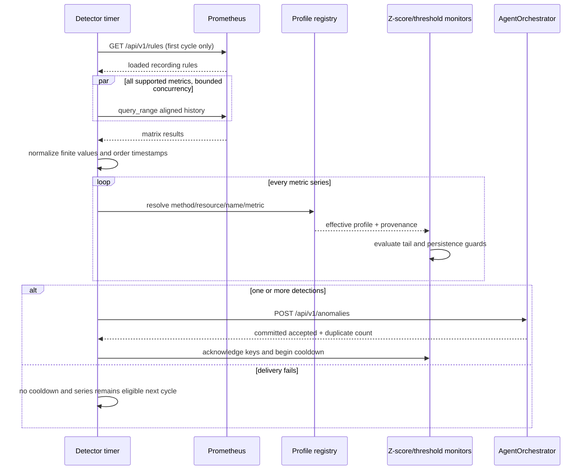

# AnomalyDetector architecture and detection flow

## Purpose and boundaries

AnomalyDetector continuously reads precomputed Kubernetes/service metrics from
Prometheus, evaluates every returned time series with bounded threshold and
Z-score profiles, and submits detected events to AgentOrchestrator.

It does not write PostgreSQL, call RCAAgent, remediate the cluster, or decide
whether an alert is a true incident. A detection is a lead. AgentOrchestrator
durably stores it and RCAAgent verifies it with broader evidence.

## Components

| Component | Responsibility |
| --- | --- |
| FastAPI process | Health and runtime detector-profile control endpoints. |
| `DetectorManager` | Owns the background cycle, monitors, series provider, and sink. |
| `PrometheusSeriesProvider` | Builds an aligned historical window and converts query results into normalized series. |
| `ZScoreMonitor` | Resolves a Z-score profile per series and evaluates recent tail points. |
| `ThresholdMonitor` | Resolves a static-threshold profile and checks consecutive violations. |
| `DetectorProfileRegistry` | Thread-safe built-in defaults and versioned in-memory overrides. |
| `AgentOrchestratorSink` | Deterministic envelopes, bounded HTTP retry, complete-batch acknowledgement. |

## End-to-end sequence

## 1. Service startup

FastAPI creates one shared `DetectorProfileRegistry`. The application lifespan
constructs `DetectorManager`, starts `detect_forever` as an asyncio task, and
exposes the registry to control endpoints. Shutdown sets a thread event, waits
for the loop, and closes both Prometheus and orchestrator HTTP clients.

`GET /health` reports API state, whether the loop is running/failed, profile
persistence, number of active profiles, and whether mutations are enabled. A
completed detector task makes health return HTTP 503 and `status=degraded`.

## 2. Prometheus recording-rule gate

The first collection checks `/api/v1/rules?type=record`. Every name returned by
`QueryBuilder.required_record_names()` must be loaded. Missing rules raise
`PrometheusConfigurationError`, stop the background loop, and make health
degraded. This prevents silent operation with incomplete detector coverage.

Required signals are based on the `anomaly_detector:` recording-rule prefix:

- deployment instance count, CPU usage/request utilization, memory request
  utilization, disk I/O, network I/O, traffic RPS, p95 response time, 5xx rate;
- node CPU, memory, disk I/O, and network I/O.

Deployment queries filter configured namespaces. Node queries exclude configured
tool/miscellaneous nodes. Namespaces and node names are escaped before becoming
PromQL regex unions.

## 3. Aligned range collection

For every cycle, the provider floors current Unix time to
`query_step_seconds`, then uses that as the shared end for every metric. Start is
`history_minutes` earlier. All queries therefore cover the same timestamps.

The collector calls `/api/v1/query_range` concurrently, bounded by
`max_concurrency`. It validates HTTP status, Prometheus `status=success`, and
the expected matrix result shape. The adapter groups results by resource, name,
and metric. Duplicate timestamps keep the last finite value; non-finite samples
are removed; remaining points are sorted.

Configuration validates that the history/step combination yields at least 123
samples, enough for the maximum 120-point lookback plus a three-point tail.

## 4. Profile resolution

Each monitor resolves its own method using this precedence:

1. exact `(method, resource, name, metric)`;
2. resource wildcard `(method, resource, "*", metric)`;
3. global `(method, "*", "*", metric)`.

If no profile supports a series, that method skips it. The selected profile ID,
version, source, and effective parameters are attached to the emitted detection
and later stored as anomaly provenance.

Built-in defaults and operator changes live only in memory. A restart restores
defaults. Profile history is versioned for the lifetime of the process, and
mutation uses optional optimistic versions (agents should always provide one).
See [agent-api.md](agent-api.md) for exact mutable parameters and safe bounds.

## 5. Z-score evaluation

The Z-score detector evaluates only the configured latest `n_tail` points.
For each point it builds a preceding history capped by `lookback`; fewer than
`min_history` samples cannot alert.

It calculates population mean/std, delta, relative delta, and score. Constant,
dominant-value, and very-low-variance baselines are suppressed unless configured
absolute/relative magnitude guards prove that the movement is still meaningful.
An alert must satisfy all applicable conditions:

- direction (`high`, `low`, or `both`);
- absolute Z-score strictly greater than `threshold`;
- `min_absolute_delta`, when configured;
- `min_relative_delta`, when configured;
- `consecutive_anomalies_required` within the evaluated tail.

The detail records current value, baseline, stddev, deltas, Z-score, severity,
lookback/tail sizes, persistence, direction, and recent values. This context is
evidence for RCA but is not a root-cause conclusion.

## 6. Threshold evaluation

Threshold profiles check the latest maximum of `n_tail` and required-consecutive
points. A violation is `value > threshold` for high direction, `value <
threshold` for low direction, or absolute magnitude for both. The consecutive
counter resets on a normal point.

The detail records value, threshold/margin, direction, severity, evaluated tail,
and persistence count. Semantic direction is immutable through the control API;
bounded tuning cannot turn an outage detector into its opposite.

## 7. Deduplication identity and delivery

For every anomalous detection, the sink constructs an envelope and calculates
SHA-256 over compact key-sorted JSON containing timestamp, resource, name,
metric, method, detail, profile ID/version, and profile parameters. That digest
is `event_id`.

The whole cycle's detections are sent as one batch to
`POST /api/v1/anomalies` using `AGENT_INGESTION_TOKEN`. Delivery retries
`orchestrator.max_attempts` with exponential waits capped at four seconds. The
response is accepted only when `accepted + duplicates` equals the submitted
count.

Duplicate identities are successful delivery because AgentOrchestrator already
committed the event. There is no detector-side database or outbox.

## 8. Cooldown semantics

Cooldown is keyed by `resource/name/metric` inside each monitor. Crucially, it
starts only after AgentOrchestrator acknowledges the complete batch. A timeout,
401, 5xx, malformed response, or partial acknowledgement leaves every detected
series eligible on the next cycle.

This is an at-least-redetect design, not guaranteed delivery. If delivery fails
and the condition recovers before the next cycle, that event can be lost. The
tradeoff avoids local persistence and is explicitly visible in logs.

## Loop failure behavior

- Missing recording rules are fatal to the loop and degrade health.
- HTTP, payload, and common data errors log the failed cycle and continue after
  the configured interval.
- A failed sink delivery does not acknowledge cooldown.
- The next collection is stateless; every cycle fetches the complete window.

## Runtime profile API

Reads are unauthenticated inside the ClusterIP boundary. Create/update/reset
require `X-Detector-Profile-Token`. Mutation can create scoped overrides,
create new revisions, or reset defaults/overrides. It cannot change method,
scope, metric, direction, numerical stability parameters, or exceed validated
bounds.

Profile scope includes namespace. A namespace-specific override cannot affect
an identically named Deployment in another application; namespace `*` remains
available only for deliberate cross-application policy.

Runtime adaptation is currently operator/control-agent initiated. LearningAgent
lessons do not automatically change detector profiles.

## Configuration

| Setting | Cluster default | Effect |
| --- | --- | --- |
| `collector.metadata.namespaces` | `online-boutique`, `teastore`, `sock-shop` | Allow-listed deployment metric scopes; add application namespaces here. |
| `collector.metadata.excluded_nodes` | `tools-node` | Node signals omitted from detection. |
| `collector.metrics.base_url` | Prometheus service DNS | Query/rule API. |
| `collector.metrics.timeout` | `10` seconds | HTTP timeout. |
| `collector.metrics.history_minutes` | `65` | Range window. |
| `collector.metrics.query_step_seconds` | `30` | Alignment and sample spacing. |
| `collector.metrics.max_concurrency` | `4` | Concurrent Prometheus calls. |
| `detector.interval_seconds` | `30` | Delay between cycles. |
| `detector.cooldown_seconds` | `120` | Post-ack per-series suppression. |
| `orchestrator.base_url` | AgentOrchestrator ClusterIP | Event sink. |
| `orchestrator.timeout_seconds` | `10` | Per-attempt delivery timeout. |
| `orchestrator.max_attempts` | `3` | Bounded delivery attempts. |

## Troubleshooting

- Health degraded with missing rules: inspect Prometheus rule groups and the
  Infrastructure recording-rule installation; do not relax the gate.
- Zero series: verify namespace labels, rule outputs, and node exclusions.
- No Istio traffic/latency/5xx: query the corresponding recording rule and raw
  `istio_requests_total`/duration buckets; confirm sidecar telemetry scraping.
- Too many alerts: resolve the exact effective profile, inspect magnitude and
  persistence guards, then make one bounded scoped revision.
- No alerts after tuning: inspect profile precedence and whether a more-specific
  override shadows the changed default.
- Repeated alerts every cycle: inspect AgentOrchestrator delivery/auth; cooldown
  intentionally does not start on failed acknowledgement.
- Profile change disappeared: expected after restart because persistence is
  `in_memory`.

## Source map

| File | Responsibility |
| --- | --- |
| `src/manager/detector.py` | Detection loop and post-delivery acknowledgement. |
| `src/collector/metrics/provider.py` | Aligned windows and normalized series. |
| `src/collector/metrics/prometheus.py` | Prometheus HTTP/rule validation/concurrency. |
| `src/collector/metrics/query.py` | Supported signals and recording-rule selectors. |
| `src/detector/logic/z_score.py` | Statistical detector and guards. |
| `src/detector/logic/threshold.py` | Threshold detector and persistence. |
| `src/adaptation/profile.py` | Defaults, precedence, bounds, versions, reset. |
| `src/controller/orchestrator.py` | Event identity, delivery retry, acknowledgement. |
| `src/api/app.py` | Health and profile control API. |
