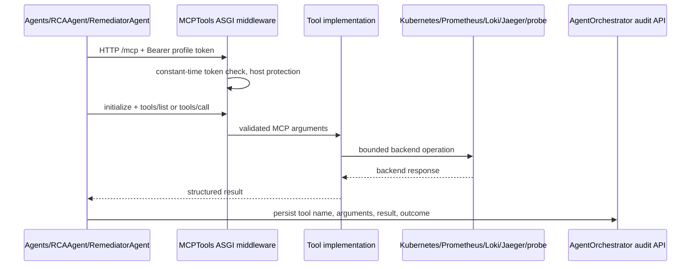

# MCPTools architecture and tool flow

## Purpose

MCPTools is the cluster-facing capability layer. It exposes Kubernetes,
observability, tracing, network, baseline profiling, and guarded remediation
functions through authenticated MCP Streamable HTTP.

One codebase/image runs as two deployments:

- `mcp-tools-investigation`: read/investigation profile used by RCAAgent;
- `mcp-tools-remediation`: investigation plus artifact/Ansible tools used by
  RemediatorAgent.

MCPTools never writes workflow or job rows. Calling agents send tool-call audits
to AgentOrchestrator. This keeps cluster credentials and database credentials in
different services.

## Transport and request path

The server uses the official MCP Python SDK's stateless JSON Streamable HTTP
application at `/mcp`. Each tool call may establish a fresh stateless MCP
session. The SDK performs initialize, tool discovery/call, and structured
response transport.

`/health` is the only unauthenticated route and returns profile identity. All
other HTTP paths require exact `Authorization: Bearer <MCP_TOKEN>`.

DNS-rebinding protection accepts loopback plus explicit in-cluster service host
names from `server.allowed_hosts`; allowed browser origins are empty.

## Profile separation

Both profiles expose the same read-oriented tools. Only remediation registers
`remediator.write_file` and `remediator.run_ansible`. The investigation kubectl
wrapper also enforces a command allowlist before process execution:

`api-resources`, `api-versions`, `auth`, `cluster-info`, `describe`, `get`,
`logs`, `rollout status`, `top`, and `version`.

Any other command returns a structured blocked result. `rollout` without
`status` is blocked. Kubernetes read-only RBAC is a second enforcement layer,
so bypassing command parsing still cannot grant mutation.

The profiles use distinct Secrets and service accounts. Never reuse their
tokens: RCAAgent should know only investigation, and RemediatorAgent only
remediation.

## Tool catalog

| Tool | Profile | Purpose |
| --- | --- | --- |
| `kubectl` | both | Bounded kubectl arguments with optional line filtering and timeout. |
| `prometheus` | both | Instant/range PromQL with bounded result filtering. |
| `loki` | both | Instant/range LogQL with time/limit/direction and filtering. |
| `jaeger.list_services` | both | Discover exact trace service names. |
| `jaeger.retrieve_slow_traces` | both | Select bounded slow traces for a service/window. |
| `jaeger.investigate_trace` | both | Summarize spans and service durations for one trace. |
| `jaeger.retrieve_bottleneck` | both | Return a bottleneck candidate for one trace. |
| `network.topology` | both | Validate Ready overlay/underlay probe coverage. |
| `network.latency_matrix` | both | Directed node RTT/jitter/loss comparisons. |
| `network.bandwidth` | both | Bounded active one-pair throughput probe. |
| `network.path` | both | Bounded path/hop/loss investigation. |
| `network.dns` | both | Service DNS lookup from one probe/node. |
| `network.tcp_connect` | both | Service-port connection timing from one node. |
| `cluster.profile_baseline` | both | Joined Kubernetes/metrics/log/network incident baseline. |
| `remediator.write_file` | remediation | Write one job/session artifact on the PVC. |
| `remediator.run_ansible` | remediation | Check or live execute a checked artifact. |

The actual JSON schemas come from MCP tool discovery. Agents should discover
instead of hard-coding a stale schema.

## Kubernetes tool

The wrapper receives either a shell-like argument string parsed with `shlex` or
an argument list. It does not provide a general shell. Filtering is a separate
`grep` argument, avoiding pipes and redirection. Timeouts are bounded by tool
configuration.

Investigation rejects mutation before execution. Remediation can invoke wider
commands, but the service account restricts actual Kubernetes authorization to
read access cluster-wide, bounded operations in explicitly bound application
namespaces, and node-maintenance verbs. The reusable
`kubernetes/application-role-binding.yaml` grants the workload ClusterRole in
one namespace; it is reapplied after namespace recreation.

## Prometheus and Loki

Prometheus supports `instant` and `range` query types with optional evaluation
time or start/end/step. A result filter can keep selected labels/fields and cap
returned series. Callers should prefer short windows and treat an empty result
as missing evidence.

Loki supports instant/range LogQL, explicit/relative windows, result limits,
direction, and filtering. Queries should include namespace/workload/pod/error
selectors to avoid broad log dumps.

The cluster ConfigMaps point to Prometheus in `monitoring` and Loki in
`observability`.

## Jaeger workflow

Tracing is intentionally split into ordered operations:

1. list services;
2. retrieve a small slow-trace set using an exact discovered service;
3. choose one trace ID;
4. investigate its span/service breakdown;
5. optionally retrieve the direct bottleneck candidate.

No trace result is proof by itself. RCA correlates it with Kubernetes, metrics,
logs, and network evidence. The cluster endpoint is the tracing Service in
`istio-system`.

## Network probes

Infrastructure prerequisites and MCPTools manifests run overlay and underlay
probe DaemonSets in namespace `utility`. Each eligible services node should
have one healthy probe per plane.

- Overlay probes exercise the pod/Flannel network.
- Underlay probes exercise node-address paths.

`network.topology` must establish probe coverage before active calls.
`latency_matrix` is capped by `max_matrix_nodes` (six by default). Bandwidth is
capped by `max_duration_seconds=10` and `max_bitrate_mbps=100`; defaults are
lower. Active results should compare affected and healthy pairs and never be
described as physical line rate.

DNS is constrained to service-resolution investigations. TCP connect validates
reachability/time only, not application health. Path probes may omit hops
because routers suppress ICMP; missing replies are not automatically failure.

## Cluster baseline profiler

`cluster.profile_baseline(namespace, window_minutes, evaluation_time,
include_error_samples)` is the mandatory first RCA tool. It joins:

- every current deployment, pod readiness/restarts/placement, services,
  endpoints, HPA and rollout state;
- every node's readiness, capacity, pressure, and resident workloads;
- bounded Prometheus service/node signals;
- bounded Loki error samples;
- passive network probe coverage;
- directed overlay/underlay latency matrix between Ready service workers.

It returns explicit coverage, missing signals, and errors. The profiler avoids
Kubernetes Events and does not run path, DNS, TCP-connect, or bandwidth probes.
It performs no mutation.

## Remediation artifact sessions

The remediation deployment mounts one PVC at `/sessions`. Every call requires
an explicit `session_id`, normally the remediation job UUID. Filenames are
validated basenames so a session cannot traverse into another path.

`write_file` stores content under the session. `run_ansible(check=true)` runs
check mode and records a successful check against a hash of the playbook,
optional inventory, and extra variables. `run_ansible(check=false)` is rejected
until the exact same execution inputs in the same session have a successful
check record. Rewriting any input changes the hash and requires a new check.

The remediation deployment uses one replica and `Recreate` strategy so session
state and PVC attachment remain unambiguous. RemediatorAgent separately audits
file content/results to AgentOrchestrator for durable workflow history.

## RBAC model

| Identity | Effective access |
| --- | --- |
| investigation SA | Cluster get/list/watch over core/app/batch/autoscaling/network/metrics resources; utility probe get/list/exec. |
| remediation SA | Same investigation reads; utility probes; bounded namespaced application mutation; node patch/update, pod delete/eviction for maintenance. |

The remediation workload ClusterRole includes workload patch/update and
selected pod/job/configmap operations, but it has no authority until a
RoleBinding grants it inside a particular application namespace. It is not a
general cluster-admin identity. Application installers create their namespaces
and apply the binding after namespace recreation. `APPLICATION_NAMESPACES` is
an optional space-separated override for binding already-running namespaces;
it is empty by default so MCPTools contains no application catalog. After
applying each requested binding, deployment fails closed unless the remediation
ServiceAccount can patch both Deployments and HorizontalPodAutoscalers in that
namespace. The binding is named
`mcp-tools-remediation-workload`; deployment removes the obsolete
`mcp-tools-remediation` RoleBinding first because Kubernetes forbids changing a
RoleBinding's `roleRef` in place.

## Configuration

| Setting | Cluster value/meaning |
| --- | --- |
| `server.port` | `8090` |
| `server.profile` | `investigation` or `remediation` |
| `server.token` | Profile-specific Secret value. |
| `server.allowed_hosts` | Exact service DNS variants. |
| `tools.kubectl.path` | `/usr/local/bin/kubectl` |
| `tools.kubectl.timeout_seconds` | `30` |
| observability endpoint timeouts | Prometheus/Loki 20s; Jaeger 120s. |
| `tools.network.namespace` | `utility` |
| `tools.network.max_duration_seconds` | `10` |
| `tools.network.max_bitrate_mbps` | `100` |
| `tools.network.max_matrix_nodes` | `6` |
| `tools.remediation_root` | `/sessions` in Kubernetes. |

## Failure behavior

Tools return structured success/error information whenever possible. An MCP
transport/auth failure is handled by the calling agent registry and becomes an
audited `ok=false` result. Backend timeouts are bounded; agents must record
missing evidence instead of assuming health.

The health route confirms process/profile only. It does not prove Prometheus,
Loki, Jaeger, kubectl, probes, or PVC operations are healthy; discover/call a
representative read tool during rollout verification.

## Troubleshooting

- MCP 401: compare the caller token with the correct profile Secret.
- Rebinding/host rejection: add only the exact intended service DNS to
  `server.allowed_hosts` and redeploy ConfigMap.
- Investigation mutation blocked: expected; use remediation only through an
  approved workflow.
- Kubernetes Forbidden: inspect service account and Role/Binding rather than
  widening the token/profile.
- Empty Prometheus/Loki/Jaeger results: verify endpoints, recording rules,
  scrape/telemetry pipelines, labels, and time window.
- Network topology missing nodes: inspect both probe DaemonSets, Ready status,
  selectors, and utility RoleBinding.
- Live Ansible blocked: check same session ID, current file SHA, successful
  check-mode result, and PVC mount.
- Artifact lost after restart: confirm remediation PVC, one replica, and
  `Recreate` deployment strategy.

## Source map

| File | Responsibility |
| --- | --- |
| `app/server.py` | MCP registration, profiles, auth middleware, transport security. |
| `app/config.py` | Profile/tool endpoint/network settings. |
| `app/tools/kubectl.py` | Process execution and output filtering. |
| `app/tools/prometheus.py` | Prometheus query and result shaping. |
| `app/tools/loki.py` | Loki query and result shaping. |
| `app/tools/jaeger.py` | Service/trace/bottleneck operations. |
| `app/tools/network.py` | Probe discovery and bounded active network tests. |
| `app/tools/profile.py` | Joined cluster baseline. |
| `app/tools/remediator.py` | Session files and check-before-live Ansible. |
| `kubernetes/rbac.yaml` | Split service accounts and authorization layers. |
| `kubernetes/network-probes.yaml` | Overlay/underlay probe DaemonSets. |

See [mcp-api.md](mcp-api.md) for the concise protocol contract.
