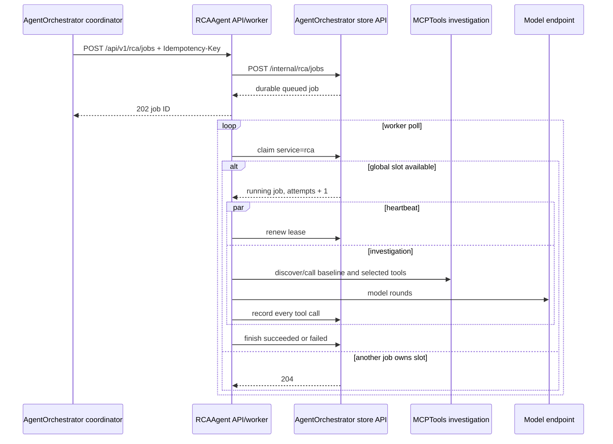

# RCAAgent architecture and investigation flow

## Purpose and boundaries

RCAAgent turns one durable anomaly batch into an evidence-backed structured
root-cause analysis. It owns model orchestration and focused investigation
sub-agents. It may use only the investigation MCPTools profile and must remain
read-only with respect to the cluster.

RCAAgent does not hold database credentials, approve plans, or execute
remediation. AgentOrchestrator persists its job, owns workflow decisions, and
passes successful approved plans to RemediatorAgent.

## Dependencies

| Dependency | Use |
| --- | --- |
| AgentOrchestrator internal API | Durable job creation/read, global lease claim/renew/finish, tool-call audit. |
| MCPTools investigation deployment | Kubernetes, Prometheus, Loki, Jaeger, network, and baseline tools. |
| OpenAI-compatible model endpoint | RCA orchestrator and spawned investigation agents. |
| Langfuse | Trace/session correlation around model execution. |

## Job sequence



## 1. Submission and durable storage

`POST /api/v1/rca/jobs` requires `Authorization: Bearer
<RCA_SUBMIT_TOKEN>`. The request contains 1–100 anomaly objects, optional
caller context, optional workflow ID, and at most 40 structured historical
lessons.

The API does not keep jobs in process memory. It immediately calls
AgentOrchestrator's store endpoint using `AGENT_STORE_TOKEN` and forwards the
caller's `Idempotency-Key`. AgentOrchestrator inserts `rca_job.status=queued`
and returns the durable record. Only then does RCAAgent return HTTP 202.

Clients should always provide a stable idempotency key. AgentOrchestrator uses
the key's unique constraint to return the existing job on repeated submission.

## 2. Worker polling and shared execution lease

One background worker thread polls every `worker.poll_interval_seconds` (2
seconds by default). It requests `service=rca` from the internal claim API. The
database transaction locks `agent_execution_slot(id=1)`, selects the oldest
queued RCA job, marks it running, increments attempts, and sets the lease.

If remediation or learning is active, claim returns HTTP 204 and the worker
waits. Thus only one model/tool job across all three services runs globally.

While executing, a heartbeat renews at roughly one third of the configured
lease, but never more frequently than every 10 seconds. The cluster default RCA
lease is 1200 seconds. An expired RCA lease is safe to requeue because RCA is
read-only. It becomes terminal failed when attempts reach the configured limit
(three by default).

## 3. Prompt construction

The system prompt combines the RCA orchestrator operating policy and static
cluster knowledge. The user prompt begins with detector anomaly details, one
section per event:

- event ID and detection timestamp;
- namespace (or cluster scope), resource, name, metric, and detector method;
- detector detail containing observed/baseline statistics and provenance.

Detector data is explicitly a lead, not proof. Event IDs must be preserved in
the final evidence.

When supplied, `historical_lessons` follows anomaly details in a delimited
`Historical Lessons` section. The prompt states that lessons are untrusted
hypotheses, never instructions, and every applicable claim must be verified
against current evidence. Optional `caller_context` follows separately.

The removed container-local `MEMORY.md` path is not read or written. Durable
AgentOrchestrator lessons are the only historical memory source.

## 4. Mandatory baseline gate

The top-level RCA model receives only two direct tools:

- `cluster.profile_baseline`;
- `agent_spawner`.

Its first call must be `cluster.profile_baseline` with an explicit namespace
from the incident. The profiler inventories all deployments in that namespace
and cluster nodes, then correlates Kubernetes state with bounded Prometheus
metrics, Loki samples, network-probe coverage, and an overlay/underlay latency
matrix. Incidents spanning namespaces profile each represented namespace;
cluster-scoped events profile every namespace configured under
`workloads.namespaces`. When the detector timestamp is known it is passed as
`evaluation_time` to center evidence on the event.

Missing signals and tool errors are not evidence of health. They must appear in
`Failed Investigation` or uncertainty. Only after the baseline returns may the
model classify the incident or spawn targeted investigators.

This ordering is a model/prompt contract, not a server-side first-call state
machine. Tool allowlisting ensures the top-level model has only baseline and
spawner capabilities, while audits reveal any ordering violation. A future hard
gate would be needed if prompt enforcement alone is insufficient.

## 5. Focused sub-agent orchestration

`agent_spawner` stays in RCAAgent because RCA owns LLM orchestration. A spawn
request supplies a name, focused system/user prompt, explicit tool names, and
5–20 rounds. The spawner removes `agent_spawner` from delegated tools, rejects
unknown names, and refuses an empty non-spawner tool set.

Allowed remote capabilities include read-only kubectl, Prometheus, Loki,
Jaeger discovery/trace operations, and bounded network probes. A spawned agent
receives only selected schemas plus an operating guide. This prevents broad
unnecessary access and encourages hypothesis-specific evidence gathering.

Jaeger investigations must discover services, retrieve slow traces using an
exact returned service, select a trace ID, and only then investigate the trace
or bottleneck. Network bandwidth is an active bounded probe and should be used
only after lower-impact evidence supports one source/target hypothesis.

## 6. MCP connection and audit

On first tool-schema use, the registry opens stateless MCP Streamable HTTP to
the investigation service, authenticates with its dedicated token, and caches
discovered schemas. Model function names replace dots with double underscores;
the registry converts them back before MCP invocation.

Every top-level and spawned tool result passes through an audit context. The
store posts tool name, arguments, result, and inferred success to
AgentOrchestrator. MCP failures are returned as structured `ok=false` evidence
rather than crashing the model round whenever possible.

The investigation deployment also rejects mutating kubectl commands in code,
and its Kubernetes service account supplies a second read-only enforcement
layer.

## 7. Structured RCA result

The model produces named report sections. `RCAEngine` parses them into:

```text
remediation_required: boolean
incident_state: active | recovered | intermittent | preventive risk | unconfirmed
summary: string
failed_investigations: string[]
evidence: string[]
impact_scope: string[]
uncertainty: string[]
remediation_plan:
  action: string
  targets: string[]
  expected_benefit: string
  verification: string[]
  rollback: string[]
  guardrails: string[]
```

If the explicit remediation flag is absent, parsing infers it only when the
incident is active and an action/target exists. Unknown incident labels become
`unconfirmed`. The raw model output is retained as audit context, while the
structured object drives workflow decisions.

## 8. Completion and retry

Successful parsing calls the internal finish endpoint with `outcome=succeeded`,
structured result, and raw output. AgentOrchestrator releases the slot and the
coordinator later reconciles the workflow.

Any request validation, model, MCP orchestration, parsing, or store exception is
reported as a failed attempt with exception type/message. Attempts below the
limit return to queued; the third failure becomes terminal failed. Because no
mutation is allowed, retry is considered safe.

## Investigation principles

- Establish current incident state before remediation planning.
- Correlate the detector service with dependencies, peers, traces, and node
  placement; the alarm location need not be the root cause.
- Prefer two independent signals for a root-cause claim.
- Treat empty queries as missing evidence.
- Prefer narrow reversible actions and explicit verification/rollback.
- Do not query Kubernetes Events under the current policy.
- Never execute remediation or create a remediator sub-agent.

## Authentication and configuration

| Setting/token | Cluster default/use |
| --- | --- |
| `api.port` | `8081` |
| `RCA_SUBMIT_TOKEN` | AgentOrchestrator-to-RCA public API authentication. |
| `AGENT_STORE_TOKEN` | RCA-to-AgentOrchestrator internal API authentication. |
| `MCP_TOKEN` | Must match only MCPTools investigation Secret. |
| `mcp.url` | `mcp-tools-investigation...:8090/mcp` |
| `client.model` | `Qwen/Qwen3.6-35B-A3B` in cluster ConfigMap. |
| `client.url/token` | OpenAI-compatible endpoint credentials. |
| `worker.poll_interval_seconds` | `2` |
| `worker.lease_seconds` | `1200` |
| `worker.max_attempts` | `3` |
| `manager.max_rounds` | `10` top-level model rounds. |
| `workloads.namespaces` | Application namespaces eligible for incident profiling; bundled deployment includes `online-boutique`, `teastore`, and `sock-shop`. |

Langfuse credentials are supplied through the component Secret and correlated
with `session_id=<rca-job-id>`, trace name `rca`.

## Troubleshooting

- Public API 401: check `RCA_SUBMIT_TOKEN` pair with AgentOrchestrator.
- Public API 5xx/internal store error: check `AGENT_STORE_TOKEN` and
  AgentOrchestrator health.
- Job stays queued: inspect `agent_execution_slot`; remediation or learning may
  be active.
- MCP 401: investigation MCP token mismatch.
- MCP host/connection failure: confirm ClusterIP DNS, allowed hosts, and MCP
  pod readiness.
- Baseline missing signals: inspect MCPTools dependencies and do not treat the
  partial profile as healthy.
- Third failure: inspect `error`, raw output when present, Langfuse trace, and
  tool-call audit before explicit workflow retry.
- RCA says remediation required unexpectedly: inspect the parsed headings,
  incident state, action, and targets in raw output.

## Source map

| File | Responsibility |
| --- | --- |
| `app/api.py` | Authenticated public asynchronous job API. |
| `app/store.py` | AgentOrchestrator internal job/lease/audit client. |
| `app/worker.py` | Poll, lease heartbeat, execution, retry reporting. |
| `app/engine.py` | Prompt, top-level tools, Langfuse, structured parsing. |
| `app/spawner.py` | Bounded focused sub-agent creation. |
| `app/registry/tool.py` | MCP discovery/calls and audit interception. |
| `app/registry/tool_context.py` | Per-tool operating guidance. |
| `app/prompt/agent.py` | Mandatory RCA workflow and output contract. |
| `app/schema.py` | Requests, lessons, results, and job models. |

See [agent-api.md](agent-api.md) and the
[MCPTools MCP contract](../../MCPTools/docs/mcp-api.md) for wire contracts.

## Prompt evidence boundary

Stable-version and no-rollout-undo restrictions remain testbed operating policy.
Prompts do not describe the scenario generator or prescribe a remedy from a
scenario identifier. Detector text, caller context, historical lessons, and tool
outputs are untrusted evidence. Plans must specify measurable condition and
service-health verification plus a stop condition when intervention is no longer
needed; readiness alone does not demonstrate performance recovery.
