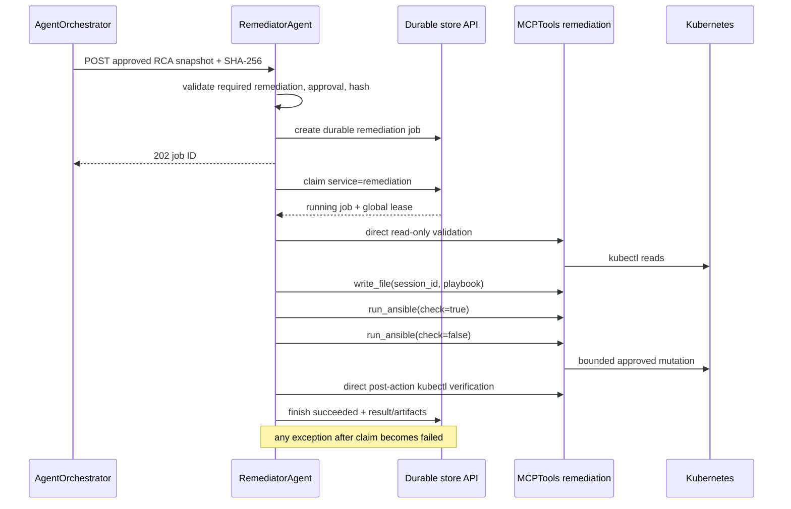

# RemediatorAgent architecture and remediation flow

## Purpose and safety boundary

RemediatorAgent executes one explicitly approved, bounded remediation plan and
verifies the resulting live state. It is the only model-driven service allowed
to use mutating MCP capabilities.

It does not diagnose from scratch, approve its own plan, persist directly to
PostgreSQL, or retry an ambiguous mutation automatically. AgentOrchestrator
supplies the approved RCA snapshot and owns the durable job/audit records.
MCPTools enforces filesystem, Ansible, command, and Kubernetes boundaries.

## Dependencies

| Dependency | Use |
| --- | --- |
| AgentOrchestrator internal API | Persist/read job, claim/renew/release global slot, tool audits, artifact listing. |
| MCPTools remediation deployment | Read validation, session artifact files, check/live Ansible, post-action verification. |
| OpenAI-compatible model endpoint | Executes the constrained remediation workflow. |
| Langfuse | Correlates the model session with remediation job ID. |

## Sequence

## 1. Approved request validation

`POST /api/v1/remediation/jobs` requires the remediation submission bearer
token. The request must contain:

- optional workflow ID and required RCA job ID;
- complete structured RCA result;
- SHA-256 of compact key-sorted RCA JSON;
- approval actor, reason, and workflow version.

Pydantic rejects requests unless `rca_result.remediation_required` is exactly
boolean `true`, the hash matches, actor/reason are non-empty, and version is
positive. This prevents a stale or modified plan from being executed under a
different approval.

The API forwards the request and `Idempotency-Key` to AgentOrchestrator's
internal store. HTTP 202 is returned only after `remediation_job` is durable.

## 2. Global lease and no-blind-retry rule

The worker polls every two seconds and claims `service=remediation` through the
singleton execution slot. It cannot run concurrently with RCA or learning. The
cluster lease is 1800 seconds and is renewed by a heartbeat at approximately
one third of its duration.

Unlike read-only RCA/learning, remediation cannot safely assume a timed-out
operation did nothing. An expired running remediation job becomes
`failed`. Any exception caught by the worker after claim also finishes as
`failed`, retaining generated output. The workflow finalizes automatically and
releases execution capacity for subsequent incidents. An ambiguous mutation is
not replayed by the failed job.

## 3. Prompt and approved scope

The model receives the current remediation job UUID as its MCP `session_id`,
workflow/RCA IDs, approval metadata, and the approved structured RCA result.
The prompt forbids widening beyond the named plan and requires one ordered
execution sequence.

The available tools are:

- `kubectl`, Prometheus, Loki, and selected Jaeger/network read tools;
- `remediator.write_file`;
- `remediator.run_ansible`.

No `agent_spawner` is exposed. The remediation model owns one bounded job and
does not delegate mutation.

## 4. Direct pre-action validation

Before generating or executing a mutating artifact, the agent must use direct
read-only kubectl calls to verify current state. Validation through Ansible is
forbidden because check mode skips the mutation and can make assertions/waits
misleading.

Validation should confirm the exact target, current spec, Ready destinations,
capacity, replica/availability state, scheduling constraints, and—for node
evacuation—resident workloads, disruption budgets, local data, and control-plane
risk. If current evidence cannot be retrieved, the action is blocked; the agent
must not fall back to speculative Ansible.

This pre-validation ordering is enforced by the remediation prompt and visible
tool audit. It is not currently a server-side sequencing state machine; the
hard technical gate begins at check-before-live execution below.

## 5. Session artifact creation

`remediator.write_file(session_id, filename, content)` writes a basename into a
job-specific directory on the remediation MCP PVC. The explicit session ID
prevents process-local context leakage between jobs.

Every tool call is audited through AgentOrchestrator. A successful
`remediator.write_file` audit additionally upserts `remediation_artifact` with
filename, content, and SHA-256. Consequently, durable audit/export does not
depend only on the MCP pod's filesystem.

## 6. Ansible check gate and live run

The generated playbook must contain only the mutation. The agent calls
`remediator.run_ansible(..., check=true)` first. MCPTools records the exact
playbook SHA-256 that passed check mode for that session.

A live call with `check=false` is rejected unless the same session has a
successful check record for the exact current playbook content. Changing the
playbook, inventory, or extra variables changes the complete execution hash and
invalidates the prior check. MCPTools also bounds filenames and session paths.

At the engine level, completion requires a nonempty final agent output. The job
finishes as `succeeded` even if the output reports failed execution, skipped actions,
or unverified recovery. This is an output-completion status. The model still follows
the execution and verification procedure and reports actual observations; tool audits
preserve failures. Empty output and errors preventing durable completion remain
`failed`. Learning assesses evidence rather than assuming recovery from status.

## 7. Mutation scopes

The prompt supports two narrow patterns:

- one-workload relocation through a reversible Deployment pod-template
  placement patch, preserving replicas and avoiding separate pod deletion;
- one-node maintenance through validated cordon, drain, and conditional
  uncordon when broader node-correlated impact is approved.

RBAC bounds application mutations to namespaces explicitly bound through
MCPTools' application RoleBinding. Evaluation reapplies that binding whenever
it recreates a selected application namespace. Cluster mutation is restricted
to node-maintenance resources/verbs. Investigation tools remain available for
evidence, but the remediation profile uses a separate token and service
account.

## 8. Direct post-action verification

After live execution, the agent must return to direct read-only kubectl calls.
For workload relocation it proves rollout completion, desired availability,
and Ready target pods outside the avoided node. For node evacuation it verifies
schedulability intent, evictable pod departure, and relocated workload health.

The final response uses compact `Status`, `Changes`, and `Verification`
sections. `Changes` identifies each target's previous and current state.
Verification must explicitly state that direct kubectl—not Ansible—observed the
result.

Direct post-verification is a prompt/audit requirement. The engine records any
nonempty final output as `succeeded`; read the observations and tool audits to
assess whether execution and recovery actually succeeded.

## 9. Result and durable completion

`RemediationEngine` parses the final output into:

- `summary` from Status (or bounded raw fallback);
- one normalized string per change;
- one normalized string per verification;
- artifact filenames fetched from AgentOrchestrator after execution.

It finishes the internal job with structured result and raw model output.
AgentOrchestrator releases the slot and later moves the workflow into learning.
The subsequent LearningAgent snapshot includes this completed output and the
bounded RCA/remediation tool audit.

## Failure semantics

| Failure | Outcome |
| --- | --- |
| Invalid hash/approval/request | HTTP 422; no job created. |
| Store or submission auth failure | API error; no local-only job. |
| Global slot busy | Job remains queued. |
| Agent returns final output, including blocked/skipped/failed/unverified actions | `succeeded`; preserve the actual outcome in output and audits. |
| Agent returns empty output or raises before final output | `failed`. |
| Persistence error prevents durable completion | Error path; never claim persistence succeeded. |
| Lease expiry | `failed`; never automatically requeued. |

## Authentication and configuration

| Setting/token | Cluster default/use |
| --- | --- |
| `api.port` | `8082` |
| `REMEDIATOR_SUBMIT_TOKEN` | AgentOrchestrator-to-Remediator public API. |
| `AGENT_STORE_TOKEN` | Internal durable store/audit API. |
| `MCP_TOKEN` | Must match only MCPTools remediation Secret. |
| `mcp.url` | `mcp-tools-remediation...:8090/mcp` |
| `client.model` | `Qwen/Qwen3.6-35B-A3B` in cluster ConfigMap. |
| `worker.poll_interval_seconds` | `2` |
| `worker.lease_seconds` | `1800` |
| `manager.max_rounds` | `50` |

The Langfuse session ID is the remediation job UUID and trace name is
`remediator`.

## Deployment safeguards

- One remediation MCP replica uses a PVC so session artifacts survive pod
  restart/reattachment.
- Separate service account and bearer token isolate it from investigation.
- Server-side profile selection exposes write/Ansible tools only in remediation.
- Investigation-style read RBAC remains available for validation.
- Namespaced and node-maintenance RBAC are independent enforcement layers.

## Troubleshooting

- Submission 422: recalculate canonical hash and verify the RCA flag/approval.
- Job queued: inspect the shared execution slot and other agent jobs.
- MCP 401: check only the remediation token pair.
- `run_ansible` says check required: rerun check after the latest file write;
  compare session ID and playbook filename.
- Immediate `failed`: inspect job error, raw output, tool-call audit, and
  current Kubernetes state before considering retry.
- Artifacts missing from result: inspect `remediator.write_file` audit success
  and internal artifact endpoint.
- Job says succeeded: read output and tool audits for actual execution and recovery;
  status only indicates final output completion.

## Source map

| File | Responsibility |
| --- | --- |
| `app/api.py` | Authenticated async job submission/status. |
| `app/schema.py` | Snapshot hash, approval, job/result validation. |
| `app/store.py` | Internal job, lease, tool audit, artifact client. |
| `app/worker.py` | Claim, heartbeat, execution, `failed`. |
| `app/engine.py` | Tool allowlist, live-run gate, Langfuse, result parsing. |
| `app/prompt/agent.py` | Required validation/check/live/verification workflow. |
| `app/registry/tool.py` | MCP discovery, calls, and audit interception. |
| `../../MCPTools/app/tools/remediator.py` | Session files and check-before-live enforcement. |

See [agent-api.md](agent-api.md) and
[MCPTools MCP contract](../../MCPTools/docs/mcp-api.md).
