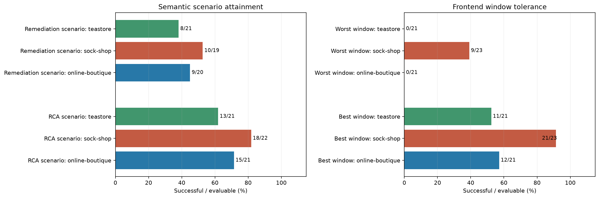

# Experiment metrics report

Generated 2026-09-28T03:51:18.014094+00:00.

## Definitions and configuration

- Rolling window: **5 minutes**; initial baseline exclusion: **5 minutes**.
- Successful output: score **> 0.8**.
- Holistic tolerance: P95 increase **< 20%**, with 5xx **≤ 0.5 requests/s**.
- Repeat selection: `latest_completed_else_latest`. Latest completed attempt per scenario is the default; otherwise the latest attempt.
- Only outputs completed within recorded chaos intervals contribute to scores, counts and timing. Missing boundaries/timestamps are excluded.
- Time to first good output means earliest completion among the highest-scoring outputs, measured from recorded chaos start.
- Differences are window minus baseline; negative means a decrease. Percentage changes are unknown for zero baselines.
- Best minimizes P95 among windows satisfying the 5xx ceiling; worst maximizes P95 without that ceiling. P95 and 5xx share the selected window.
- P95 is a time average of archived rolling percentiles. Missing 5xx samples may be imputed at recorded traffic timestamps; counts are disclosed.
- Holistic totals include completed, evaluable runs only. Unknown values are never zero or success. Session and scenario totals have separate denominators.
- This script reads existing grades and recomputes performance offline. Missing grades leave semantic scores unknown; no model calls occur.
- Archives are discovered recursively, including preserved local campaigns. The attempts table records which runs were selected.

## Aggregate metrics across all selected runs

This all-selected-run aggregate includes selected technical runs that did not complete. The completed-run analysis below uses the primary cohort.

| metric | count | evaluable | percent_of_evaluable |
| --- | --- | --- | --- |
| Successful RCA sessions (score &gt; 0.8) | 121 | 519 | 23.3141 |
| Scenarios/runs with successful RCA | 48 | 66 | 72.7273 |
| Successful REMEDIATION sessions (score &gt; 0.8) | 40 | 366 | 10.9290 |
| Scenarios/runs with successful REMEDIATION | 28 | 62 | 45.1613 |
| Holistic performance within tolerance (best window) | 44 | 65 | 67.6923 |
| Holistic performance within tolerance (worst window) | 9 | 65 | 13.8462 |

## Completed-run analysis

The tables below use selected completed runs only. Failed or incomplete selected runs remain in the exclusion audit. Fractions count success over evaluable runs or sessions; unknown scores do not enter semantic denominators. A run completes only when metadata or run-status reports completion, its execution return code is zero or absent, and neither source reports failure or interruption.

### Cohort

| Application | Attempts | Selected scenarios/runs | Completed analyzed | Selected technical exclusions |
| --- | --- | --- | --- | --- |
| sock-shop | 23 | 23 | 23 | 0 |
| online-boutique | 23 | 21 | 21 | 0 |
| teastore | 23 | 23 | 21 | 2 |
| Total | 69 | 67 | 65 | 2 |

### Semantic success and window tolerance

| Application | Metric | Success | Evaluable | Percent |
| --- | --- | --- | --- | --- |
| sock-shop | Successful RCA sessions (score &gt; 0.8) | 41 | 169 | 24.2604 |
| sock-shop | Scenarios/runs with successful RCA | 18 | 22 | 81.8182 |
| sock-shop | Successful REMEDIATION sessions (score &gt; 0.8) | 19 | 103 | 18.4466 |
| sock-shop | Scenarios/runs with successful REMEDIATION | 10 | 19 | 52.6316 |
| sock-shop | Holistic performance within tolerance (best window) | 21 | 23 | 91.3043 |
| sock-shop | Holistic performance within tolerance (worst window) | 9 | 23 | 39.1304 |
| online-boutique | Successful RCA sessions (score &gt; 0.8) | 48 | 163 | 29.4479 |
| online-boutique | Scenarios/runs with successful RCA | 15 | 21 | 71.4286 |
| online-boutique | Successful REMEDIATION sessions (score &gt; 0.8) | 10 | 95 | 10.5263 |
| online-boutique | Scenarios/runs with successful REMEDIATION | 9 | 20 | 45.0000 |
| online-boutique | Holistic performance within tolerance (best window) | 12 | 21 | 57.1429 |
| online-boutique | Holistic performance within tolerance (worst window) | 0 | 21 | 0.0000 |
| teastore | Successful RCA sessions (score &gt; 0.8) | 30 | 171 | 17.5439 |
| teastore | Scenarios/runs with successful RCA | 13 | 21 | 61.9048 |
| teastore | Successful REMEDIATION sessions (score &gt; 0.8) | 10 | 153 | 6.5359 |
| teastore | Scenarios/runs with successful REMEDIATION | 8 | 21 | 38.0952 |
| teastore | Holistic performance within tolerance (best window) | 11 | 21 | 52.3810 |
| teastore | Holistic performance within tolerance (worst window) | 0 | 21 | 0.0000 |
| Pooled total | Successful RCA sessions (score &gt; 0.8) | 119 | 503 | 23.6581 |
| Pooled total | Scenarios/runs with successful RCA | 46 | 64 | 71.8750 |
| Pooled total | Successful REMEDIATION sessions (score &gt; 0.8) | 39 | 351 | 11.1111 |
| Pooled total | Scenarios/runs with successful REMEDIATION | 27 | 60 | 45.0000 |
| Pooled total | Holistic performance within tolerance (best window) | 44 | 65 | 67.6923 |
| Pooled total | Holistic performance within tolerance (worst window) | 9 | 65 | 13.8462 |

### Score means

| Application | Output | Mean scenario maximum | Mean scenario mean | Pooled session mean |
| --- | --- | --- | --- | --- |
| sock-shop | rca | 0.8415 | 0.4582 | 0.4564 |
| sock-shop | remediation | 0.7493 | 0.4173 | 0.3379 |
| online-boutique | rca | 0.8411 | 0.4815 | 0.4604 |
| online-boutique | remediation | 0.6094 | 0.3085 | 0.3353 |
| teastore | rca | 0.7381 | 0.3636 | 0.3688 |
| teastore | remediation | 0.5887 | 0.2072 | 0.2053 |

### Sessions and time to maximum score

| Application | Output | Known sessions | Session counts known / runs | Scored | Sessions median | Sessions min | Sessions max | Time n | Time median (min) | Time Q1 | Time Q3 | Time min | Time max |
| --- | --- | --- | --- | --- | --- | --- | --- | --- | --- | --- | --- | --- | --- |
| sock-shop | rca | 169.0000 | 23/23 | 169 | 8.0000 | 0.0000 | 15.0000 | 22 | 13.8615 | 7.2705 | 25.0828 | 4.4599 | 54.8804 |
| sock-shop | remediation | 110.0000 | 23/23 | 103 | 5.0000 | 0.0000 | 9.0000 | 19 | 15.3243 | 10.4915 | 33.0635 | 3.7573 | 59.0634 |
| online-boutique | rca | 163.0000 | 21/21 | 163 | 7.0000 | 4.0000 | 14.0000 | 21 | 13.3613 | 9.3115 | 18.7601 | 5.8011 | 39.2670 |
| online-boutique | remediation | 107.0000 | 21/21 | 95 | 4.0000 | 0.0000 | 9.0000 | 20 | 17.4002 | 13.6406 | 27.3866 | 5.1164 | 58.4307 |
| teastore | rca | 171.0000 | 21/21 | 171 | 8.0000 | 4.0000 | 10.0000 | 21 | 21.7885 | 8.4487 | 34.6103 | 6.8483 | 53.4248 |
| teastore | remediation | 160.0000 | 21/21 | 153 | 8.0000 | 4.0000 | 9.0000 | 21 | 22.7014 | 10.4637 | 34.8523 | 3.2847 | 58.3791 |

### Window performance

| Application | Best tolerance | Worst tolerance | Median best P95 change (%) | Median worst P95 change (%) | Best P95 n | Worst P95 n |
| --- | --- | --- | --- | --- | --- | --- |
| sock-shop | 21/23 | 9/23 | -0.8200 | 49.7740 | 22 | 23 |
| online-boutique | 12/21 | 0/21 | 1.0236 | 133.8690 | 20 | 21 |
| teastore | 11/21 | 0/21 | 2.5032 | 11034.0891 | 20 | 21 |
| Pooled total | 44/65 | 9/65 | -0.6199 | 441.5719 | 62 | 65 |

### Semantic success versus best-window tolerance

| Output | Semantic success | Best passes | Best fails | Best unknown | Total |
| --- | --- | --- | --- | --- | --- |
| rca | Yes | 31 | 15 | 0 | 46 |
| rca | No | 12 | 6 | 0 | 18 |
| remediation | Yes | 19 | 8 | 0 | 27 |
| remediation | No | 20 | 13 | 0 | 33 |

### Fault-family outcomes

| Family | Runs | RCA success | Remediation success | Best tolerance | Worst tolerance |
| --- | --- | --- | --- | --- | --- |
| Node CPU | 3 | 2/3 | 1/3 | 3/3 | 1/3 |
| Node delay | 9 | 9/9 | 7/9 | 9/9 | 0/9 |
| Node packet loss | 9 | 4/9 | 2/9 | 2/9 | 0/9 |
| Node memory | 2 | 0/1 | 1/1 | 2/2 | 1/2 |
| Pod CPU headroom | 8 | 6/8 | 1/8 | 6/8 | 2/8 |
| Pod bandwidth | 5 | 0/5 | 0/2 | 4/5 | 2/5 |
| Pod capacity loss | 5 | 5/5 | 1/5 | 2/5 | 0/5 |
| Pod CPU | 15 | 13/15 | 9/14 | 8/15 | 2/15 |
| Pod memory | 9 | 7/9 | 5/9 | 8/9 | 1/9 |

### Fault families by application

| Family | Application | Runs | RCA success | Remediation success | Best tolerance | Worst tolerance |
| --- | --- | --- | --- | --- | --- | --- |
| Node CPU | online-boutique | 1 | 1/1 | 0/1 | 1/1 | 0/1 |
| Node CPU | sock-shop | 1 | 1/1 | 1/1 | 1/1 | 1/1 |
| Node CPU | teastore | 1 | 0/1 | 0/1 | 1/1 | 0/1 |
| Node delay | online-boutique | 3 | 3/3 | 2/3 | 3/3 | 0/3 |
| Node delay | sock-shop | 3 | 3/3 | 2/3 | 3/3 | 0/3 |
| Node delay | teastore | 3 | 3/3 | 3/3 | 3/3 | 0/3 |
| Node packet loss | online-boutique | 3 | 2/3 | 1/3 | 0/3 | 0/3 |
| Node packet loss | sock-shop | 3 | 2/3 | 1/3 | 2/3 | 0/3 |
| Node packet loss | teastore | 3 | 0/3 | 0/3 | 0/3 | 0/3 |
| Node memory | online-boutique | 1 | 0/1 | 1/1 | 1/1 | 0/1 |
| Node memory | sock-shop | 1 | — | — | 1/1 | 1/1 |
| Node memory | teastore | 0 | — | — | — | — |
| Pod CPU headroom | online-boutique | 3 | 2/3 | 0/3 | 2/3 | 0/3 |
| Pod CPU headroom | sock-shop | 3 | 3/3 | 1/3 | 3/3 | 2/3 |
| Pod CPU headroom | teastore | 2 | 1/2 | 0/2 | 1/2 | 0/2 |
| Pod bandwidth | online-boutique | 1 | 0/1 | — | 1/1 | 0/1 |
| Pod bandwidth | sock-shop | 2 | 0/2 | — | 2/2 | 2/2 |
| Pod bandwidth | teastore | 2 | 0/2 | 0/2 | 1/2 | 0/2 |
| Pod capacity loss | online-boutique | 1 | 1/1 | 0/1 | 0/1 | 0/1 |
| Pod capacity loss | sock-shop | 2 | 2/2 | 0/2 | 1/2 | 0/2 |
| Pod capacity loss | teastore | 2 | 2/2 | 1/2 | 1/2 | 0/2 |
| Pod CPU | online-boutique | 5 | 5/5 | 4/5 | 1/5 | 0/5 |
| Pod CPU | sock-shop | 5 | 4/5 | 3/4 | 5/5 | 2/5 |
| Pod CPU | teastore | 5 | 4/5 | 2/5 | 2/5 | 0/5 |
| Pod memory | online-boutique | 3 | 1/3 | 1/3 | 3/3 | 0/3 |
| Pod memory | sock-shop | 3 | 3/3 | 2/3 | 3/3 | 1/3 |
| Pod memory | teastore | 3 | 3/3 | 2/3 | 2/3 | 0/3 |

### Selected technical exclusions

| application | scenario | run | archive_status | grade_status |
| --- | --- | --- | --- | --- |
| teastore | teastore-node-memory-worker-3-one-hour | 20260923-161855-teastore-node-memory-worker-3-one-hour-09476bb4 | cleanup_failed | graded |
| teastore | teastore-pod-webui-cpu-headroom-all-one-hour | 20260924-034047-teastore-pod-webui-cpu-headroom-all-one-hour-844b969f | completed | graded |

Scenario means weight each evaluable run equally; pooled session means weight each scored output equally. Time quartiles use runs with a scored maximum and available completion time. Known sessions sum runs with a measured chaos-only count; “Session counts known / runs” exposes missing run counts. Best-window P95 medians exclude runs with no admissible best window; those runs remain known tolerance failures. Fault families are parsed from scenario names. These descriptive comparisons do not establish agent-caused recovery.

## sock-shop

Workload: `front-end`; namespace: `sock-shop`. 23 attempts; 23 selected scenario/run rows; 23 completed selected runs.

Archives: `/Users/home/Universities/ResearchProject/Agents/EvaluationPlatform/Grader/results/sock-shop`. Grades: `/Users/home/Universities/ResearchProject/Agents/EvaluationPlatform/Grader/grades/sock-shop`.

### Aggregate metrics (all selected runs)

| Metric | Count | Evaluable denominator | Percent of evaluable |
| --- | --- | --- | --- |
| Successful RCA sessions (score &gt; 0.8) | 41 | 169 | 24.2604 |
| Scenarios/runs with successful RCA | 18 | 22 | 81.8182 |
| Successful REMEDIATION sessions (score &gt; 0.8) | 19 | 103 | 18.4466 |
| Scenarios/runs with successful REMEDIATION | 10 | 19 | 52.6316 |
| Holistic performance within tolerance (best window) | 21 | 23 | 91.3043 |
| Holistic performance within tolerance (worst window) | 9 | 23 | 39.1304 |

### RCA metrics per scenario

| Scenario | Max score | Average score | Sessions during chaos | Scored sessions | Time to first highest score (min) | Timing status |
| --- | --- | --- | --- | --- | --- | --- |
| sock-shop-node-cpu-worker-2-one-hour | 1.0000 | 0.6458 | 9 | 9 | 54.8804 | available |
| sock-shop-node-delay-worker-2-one-hour | 1.0000 | 0.3175 | 10 | 10 | 14.8172 | available |
| sock-shop-node-delay-worker-3-one-hour | 0.9375 | 0.8875 | 3 | 3 | 7.0092 | available |
| sock-shop-node-delay-worker-5-one-hour | 1.0000 | 0.7179 | 7 | 7 | 5.7427 | available |
| sock-shop-node-loss-worker-1-one-hour | 0.6750 | 0.2091 | 11 | 11 | 15.8725 | available |
| sock-shop-node-loss-worker-2-one-hour | 0.9375 | 0.2922 | 8 | 8 | 27.6649 | available |
| sock-shop-node-loss-worker-3-one-hour | 1.0000 | 0.4550 | 5 | 5 | 43.0743 | available |
| sock-shop-node-memory-worker-3-one-hour | Unknown | Unknown | 0 | 0 | Unknown | no_scored_output |
| sock-shop-pod-carts-cpu-all-one-hour | 0.8625 | 0.4433 | 15 | 15 | 13.9712 | available |
| sock-shop-pod-carts-db-memory-all-one-hour | 1.0000 | 0.2597 | 9 | 9 | 9.6047 | available |
| sock-shop-pod-catalogue-bandwidth-all-one-hour | 0.1125 | 0.0375 | 3 | 3 | 31.7264 | available |
| sock-shop-pod-catalogue-cpu-all-one-hour | 0.8875 | 0.5538 | 13 | 13 | 9.4094 | available |
| sock-shop-pod-catalogue-cpu-headroom-all-one-hour | 0.9500 | 0.4236 | 9 | 9 | 8.0544 | available |
| sock-shop-pod-front-end-cpu-headroom-all-one-hour | 1.0000 | 0.5604 | 6 | 6 | 17.3364 | available |
| sock-shop-pod-orders-capacity-loss-one-hour | 1.0000 | 0.7750 | 6 | 6 | 14.8179 | available |
| sock-shop-pod-orders-cpu-all-one-hour | 1.0000 | 0.6406 | 4 | 4 | 6.0904 | available |
| sock-shop-pod-orders-cpu-headroom-all-one-hour | 0.9250 | 0.5306 | 9 | 9 | 12.8546 | available |
| sock-shop-pod-payment-capacity-loss-one-hour | 0.8625 | 0.5250 | 7 | 7 | 38.0038 | available |
| sock-shop-pod-payment-cpu-all-one-hour | 0.4750 | 0.2237 | 10 | 10 | 4.4599 | available |
| sock-shop-pod-shipping-bandwidth-all-one-hour | 0.0000 | 0.0000 | 1 | 1 | 27.9366 | available |
| sock-shop-pod-shipping-memory-all-one-hour | 0.8875 | 0.6125 | 4 | 4 | 13.7518 | available |
| sock-shop-pod-user-cpu-all-one-hour | 1.0000 | 0.4937 | 12 | 12 | 5.2410 | available |
| sock-shop-pod-user-memory-all-one-hour | 1.0000 | 0.4750 | 8 | 8 | 6.3916 | available |

### Remediation metrics per scenario

| Scenario | Max score | Average score | Sessions during chaos | Scored sessions | Time to first highest score (min) | Timing status |
| --- | --- | --- | --- | --- | --- | --- |
| sock-shop-node-cpu-worker-2-one-hour | 0.9625 | 0.5232 | 7 | 7 | 56.7648 | available |
| sock-shop-node-delay-worker-2-one-hour | 0.6750 | 0.1214 | 8 | 7 | 17.4683 | available |
| sock-shop-node-delay-worker-3-one-hour | 1.0000 | 0.6667 | 3 | 3 | 8.5571 | available |
| sock-shop-node-delay-worker-5-one-hour | 1.0000 | 0.6225 | 5 | 5 | 13.8911 | available |
| sock-shop-node-loss-worker-1-one-hour | 0.8750 | 0.3679 | 8 | 7 | 17.7304 | available |
| sock-shop-node-loss-worker-2-one-hour | 0.7500 | 0.3797 | 8 | 8 | 30.8992 | available |
| sock-shop-node-loss-worker-3-one-hour | 0.5500 | 0.1833 | 3 | 3 | 36.8433 | available |
| sock-shop-node-memory-worker-3-one-hour | Unknown | Unknown | 0 | 0 | Unknown | no_scored_output |
| sock-shop-pod-carts-cpu-all-one-hour | Unknown | Unknown | 0 | 0 | Unknown | no_scored_output |
| sock-shop-pod-carts-db-memory-all-one-hour | 0.5875 | 0.0979 | 9 | 6 | 10.6888 | available |
| sock-shop-pod-catalogue-bandwidth-all-one-hour | Unknown | Unknown | 0 | 0 | Unknown | no_scored_output |
| sock-shop-pod-catalogue-cpu-all-one-hour | 1.0000 | 0.9083 | 3 | 3 | 10.8707 | available |
| sock-shop-pod-catalogue-cpu-headroom-all-one-hour | 0.4250 | 0.1766 | 8 | 8 | 10.2941 | available |
| sock-shop-pod-front-end-cpu-headroom-all-one-hour | 1.0000 | 0.4750 | 6 | 6 | 3.7573 | available |
| sock-shop-pod-orders-capacity-loss-one-hour | 0.3875 | 0.1850 | 6 | 5 | 48.2998 | available |
| sock-shop-pod-orders-cpu-all-one-hour | 0.8750 | 0.8750 | 1 | 1 | 8.9403 | available |
| sock-shop-pod-orders-cpu-headroom-all-one-hour | 0.7375 | 0.1500 | 9 | 8 | 15.3243 | available |
| sock-shop-pod-payment-capacity-loss-one-hour | 0.4500 | 0.1375 | 7 | 7 | 59.0634 | available |
| sock-shop-pod-payment-cpu-all-one-hour | 0.0000 | 0.0000 | 8 | 8 | 11.4271 | available |
| sock-shop-pod-shipping-bandwidth-all-one-hour | Unknown | Unknown | 0 | 0 | Unknown | no_scored_output |
| sock-shop-pod-shipping-memory-all-one-hour | 1.0000 | 0.7625 | 3 | 3 | 15.7505 | available |
| sock-shop-pod-user-cpu-all-one-hour | 0.9625 | 0.4688 | 4 | 4 | 35.2277 | available |
| sock-shop-pod-user-memory-all-one-hour | 1.0000 | 0.8281 | 4 | 4 | 10.2016 | available |

### Baseline reference

| Scenario | P95 (s) | 5xx (requests/s) |
| --- | --- | --- |
| sock-shop-node-cpu-worker-2-one-hour | 0.0948 | 0.0000 |
| sock-shop-node-delay-worker-2-one-hour | 0.0960 | 0.0000 |
| sock-shop-node-delay-worker-3-one-hour | 0.0955 | 0.0000 |
| sock-shop-node-delay-worker-5-one-hour | 0.0953 | 0.0000 |
| sock-shop-node-loss-worker-1-one-hour | 0.0958 | 0.0000 |
| sock-shop-node-loss-worker-2-one-hour | 0.0949 | 0.0000 |
| sock-shop-node-loss-worker-3-one-hour | 0.0946 | 0.0000 |
| sock-shop-node-memory-worker-3-one-hour | 0.0953 | 0.0000 |
| sock-shop-pod-carts-cpu-all-one-hour | 0.0941 | 0.0000 |
| sock-shop-pod-carts-db-memory-all-one-hour | 0.0929 | 0.0000 |
| sock-shop-pod-catalogue-bandwidth-all-one-hour | 0.0937 | 0.0000 |
| sock-shop-pod-catalogue-cpu-all-one-hour | 0.0950 | 0.0000 |
| sock-shop-pod-catalogue-cpu-headroom-all-one-hour | 0.4451 | 0.0552 |
| sock-shop-pod-front-end-cpu-headroom-all-one-hour | 0.4440 | 0.0248 |
| sock-shop-pod-orders-capacity-loss-one-hour | 0.0940 | 0.0000 |
| sock-shop-pod-orders-cpu-all-one-hour | 0.0945 | 0.0000 |
| sock-shop-pod-orders-cpu-headroom-all-one-hour | 0.4704 | 0.0000 |
| sock-shop-pod-payment-capacity-loss-one-hour | 0.0940 | 0.0000 |
| sock-shop-pod-payment-cpu-all-one-hour | 0.0963 | 0.0000 |
| sock-shop-pod-shipping-bandwidth-all-one-hour | 0.0929 | 0.0000 |
| sock-shop-pod-shipping-memory-all-one-hour | 0.0934 | 0.0000 |
| sock-shop-pod-user-cpu-all-one-hour | 0.0968 | 0.0000 |
| sock-shop-pod-user-memory-all-one-hour | 0.0926 | 0.0000 |

### Best rolling window versus baseline

| Scenario | P95 (s) | P95 difference (s) | P95 change (%) | 5xx (requests/s) | 5xx difference (requests/s) | 5xx change (%) | Within tolerance |
| --- | --- | --- | --- | --- | --- | --- | --- |
| sock-shop-node-cpu-worker-2-one-hour | 0.0696 | -0.0253 | -26.6388 | 0.0000 | 0.0000 | Unknown | Yes |
| sock-shop-node-delay-worker-2-one-hour | 0.0786 | -0.0175 | -18.1801 | 0.0000 | 0.0000 | Unknown | Yes |
| sock-shop-node-delay-worker-3-one-hour | 0.0950 | -0.0004 | -0.4584 | 0.0000 | 0.0000 | Unknown | Yes |
| sock-shop-node-delay-worker-5-one-hour | 0.0930 | -0.0023 | -2.4273 | 0.0000 | 0.0000 | Unknown | Yes |
| sock-shop-node-loss-worker-1-one-hour | 0.1403 | 0.0445 | 46.4773 | 0.0000 | 0.0000 | Unknown | No |
| sock-shop-node-loss-worker-2-one-hour | 0.1000 | 0.0051 | 5.4248 | 0.0000 | 0.0000 | Unknown | Yes |
| sock-shop-node-loss-worker-3-one-hour | 0.0946 | -0.0000 | -0.0406 | 0.0000 | 0.0000 | Unknown | Yes |
| sock-shop-node-memory-worker-3-one-hour | 0.0931 | -0.0022 | -2.3218 | 0.0000 | 0.0000 | Unknown | Yes |
| sock-shop-pod-carts-cpu-all-one-hour | 0.0930 | -0.0011 | -1.1722 | 0.0000 | 0.0000 | Unknown | Yes |
| sock-shop-pod-carts-db-memory-all-one-hour | 0.0923 | -0.0006 | -0.6423 | 0.0000 | 0.0000 | Unknown | Yes |
| sock-shop-pod-catalogue-bandwidth-all-one-hour | 0.0931 | -0.0006 | -0.5975 | 0.0000 | 0.0000 | Unknown | Yes |
| sock-shop-pod-catalogue-cpu-all-one-hour | 0.0979 | 0.0029 | 3.0097 | 0.0000 | 0.0000 | Unknown | Yes |
| sock-shop-pod-catalogue-cpu-headroom-all-one-hour | 0.1224 | -0.3227 | -72.5009 | 0.0000 | -0.0552 | -100.0000 | Yes |
| sock-shop-pod-front-end-cpu-headroom-all-one-hour | 0.1010 | -0.3431 | -77.2588 | 0.0000 | -0.0248 | -100.0000 | Yes |
| sock-shop-pod-orders-capacity-loss-one-hour | 0.1070 | 0.0130 | 13.8095 | 0.1133 | 0.1133 | Unknown | Yes |
| sock-shop-pod-orders-cpu-all-one-hour | 0.1031 | 0.0086 | 9.0770 | 0.0000 | 0.0000 | Unknown | Yes |
| sock-shop-pod-orders-cpu-headroom-all-one-hour | 0.0950 | -0.3754 | -79.8102 | 0.0000 | 0.0000 | Unknown | Yes |
| sock-shop-pod-payment-capacity-loss-one-hour | Unknown | Unknown | Unknown | Unknown | Unknown | Unknown | No |
| sock-shop-pod-payment-cpu-all-one-hour | 0.0953 | -0.0010 | -1.0402 | 0.0251 | 0.0251 | Unknown | Yes |
| sock-shop-pod-shipping-bandwidth-all-one-hour | 0.0917 | -0.0011 | -1.1932 | 0.0000 | 0.0000 | Unknown | Yes |
| sock-shop-pod-shipping-memory-all-one-hour | 0.0925 | -0.0009 | -0.9977 | 0.0000 | 0.0000 | Unknown | Yes |
| sock-shop-pod-user-cpu-all-one-hour | 0.0981 | 0.0013 | 1.3228 | 0.0377 | 0.0377 | Unknown | Yes |
| sock-shop-pod-user-memory-all-one-hour | 0.0922 | -0.0005 | -0.4912 | 0.0000 | 0.0000 | Unknown | Yes |

### Worst rolling window versus baseline

| Scenario | P95 (s) | P95 difference (s) | P95 change (%) | 5xx (requests/s) | 5xx difference (requests/s) | 5xx change (%) | Within tolerance |
| --- | --- | --- | --- | --- | --- | --- | --- |
| sock-shop-node-cpu-worker-2-one-hour | 0.0950 | 0.0002 | 0.1744 | 0.0000 | 0.0000 | Unknown | Yes |
| sock-shop-node-delay-worker-2-one-hour | 4.1130 | 4.0170 | 4182.4301 | 0.0000 | 0.0000 | Unknown | No |
| sock-shop-node-delay-worker-3-one-hour | 3.5559 | 3.4604 | 3624.8194 | 0.0048 | 0.0048 | Unknown | No |
| sock-shop-node-delay-worker-5-one-hour | 1.4021 | 1.3069 | 1371.5351 | 0.0492 | 0.0492 | Unknown | No |
| sock-shop-node-loss-worker-1-one-hour | 0.7965 | 0.7007 | 731.4407 | 0.1046 | 0.1046 | Unknown | No |
| sock-shop-node-loss-worker-2-one-hour | 0.5715 | 0.4766 | 502.4162 | 1.5537 | 1.5537 | Unknown | No |
| sock-shop-node-loss-worker-3-one-hour | 0.5123 | 0.4177 | 441.5719 | 0.2013 | 0.2013 | Unknown | No |
| sock-shop-node-memory-worker-3-one-hour | 0.0947 | -0.0006 | -0.6195 | 0.0000 | 0.0000 | Unknown | Yes |
| sock-shop-pod-carts-cpu-all-one-hour | 0.0939 | -0.0002 | -0.1759 | 0.0000 | 0.0000 | Unknown | Yes |
| sock-shop-pod-carts-db-memory-all-one-hour | 0.1762 | 0.0833 | 89.6514 | 0.6026 | 0.6026 | Unknown | No |
| sock-shop-pod-catalogue-bandwidth-all-one-hour | 0.0950 | 0.0013 | 1.3637 | 0.0000 | 0.0000 | Unknown | Yes |
| sock-shop-pod-catalogue-cpu-all-one-hour | 0.1053 | 0.0103 | 10.8486 | 0.9758 | 0.9758 | Unknown | No |
| sock-shop-pod-catalogue-cpu-headroom-all-one-hour | 0.4015 | -0.0435 | -9.7832 | 0.2246 | 0.1694 | 307.1534 | Yes |
| sock-shop-pod-front-end-cpu-headroom-all-one-hour | 0.6650 | 0.2210 | 49.7740 | 0.0000 | -0.0248 | -100.0000 | No |
| sock-shop-pod-orders-capacity-loss-one-hour | 0.1688 | 0.0748 | 79.4849 | 5.9643 | 5.9643 | Unknown | No |
| sock-shop-pod-orders-cpu-all-one-hour | 0.1796 | 0.0851 | 90.0576 | 0.0000 | 0.0000 | Unknown | No |
| sock-shop-pod-orders-cpu-headroom-all-one-hour | 0.5216 | 0.0513 | 10.9051 | 0.0837 | 0.0837 | Unknown | Yes |
| sock-shop-pod-payment-capacity-loss-one-hour | 0.5304 | 0.4364 | 464.1696 | 13.3714 | 13.3714 | Unknown | No |
| sock-shop-pod-payment-cpu-all-one-hour | 0.1957 | 0.0994 | 103.2397 | 0.0155 | 0.0155 | Unknown | No |
| sock-shop-pod-shipping-bandwidth-all-one-hour | 0.0932 | 0.0003 | 0.3366 | 0.0000 | 0.0000 | Unknown | Yes |
| sock-shop-pod-shipping-memory-all-one-hour | 0.0955 | 0.0021 | 2.2665 | 0.0000 | 0.0000 | Unknown | Yes |
| sock-shop-pod-user-cpu-all-one-hour | 0.1105 | 0.0138 | 14.2075 | 0.0435 | 0.0435 | Unknown | Yes |
| sock-shop-pod-user-memory-all-one-hour | 0.1119 | 0.0193 | 20.8081 | 0.2717 | 0.2717 | Unknown | No |

### Window evidence and missing data

| Scenario | Window status | Reason | Best start (UTC) | Best end (UTC) | Worst start (UTC) | Worst end (UTC) | Baseline imputed 5xx samples | Best imputed 5xx samples | Worst imputed 5xx samples |
| --- | --- | --- | --- | --- | --- | --- | --- | --- | --- |
| sock-shop-node-cpu-worker-2-one-hour | evaluable | Unknown | 2026-09-16T06:14:52.367841+00:00 | 2026-09-16T06:19:52.367841+00:00 | 2026-09-16T06:01:22.367841+00:00 | 2026-09-16T06:06:22.367841+00:00 | 0 | 0.0000 | 0 |
| sock-shop-node-delay-worker-2-one-hour | evaluable | Unknown | 2026-09-15T09:49:36.458569+00:00 | 2026-09-15T09:54:36.458569+00:00 | 2026-09-15T09:33:51.458569+00:00 | 2026-09-15T09:38:51.458569+00:00 | 0 | 0.0000 | 0 |
| sock-shop-node-delay-worker-3-one-hour | evaluable | Unknown | 2026-09-15T08:09:54.666178+00:00 | 2026-09-15T08:14:54.666178+00:00 | 2026-09-15T07:42:09.666178+00:00 | 2026-09-15T07:47:09.666178+00:00 | 100 | 20.0000 | 0 |
| sock-shop-node-delay-worker-5-one-hour | evaluable | Unknown | 2026-09-15T11:42:06.416225+00:00 | 2026-09-15T11:47:06.416225+00:00 | 2026-09-15T11:27:06.416225+00:00 | 2026-09-15T11:32:06.416225+00:00 | 100 | 20.0000 | 0 |
| sock-shop-node-loss-worker-1-one-hour | evaluable | Unknown | 2026-09-15T13:54:03.422098+00:00 | 2026-09-15T13:59:03.422098+00:00 | 2026-09-15T13:20:18.422098+00:00 | 2026-09-15T13:25:18.422098+00:00 | 0 | 0.0000 | 0 |
| sock-shop-node-loss-worker-2-one-hour | evaluable | Unknown | 2026-09-15T16:01:27.216173+00:00 | 2026-09-15T16:06:27.216173+00:00 | 2026-09-15T15:14:57.216173+00:00 | 2026-09-15T15:19:57.216173+00:00 | 100 | 0.0000 | 0 |
| sock-shop-node-loss-worker-3-one-hour | evaluable | Unknown | 2026-09-15T17:54:04.427557+00:00 | 2026-09-15T17:59:04.427557+00:00 | 2026-09-15T17:04:49.427557+00:00 | 2026-09-15T17:09:49.427557+00:00 | 0 | 0.0000 | 0 |
| sock-shop-node-memory-worker-3-one-hour | evaluable | Unknown | 2026-09-16T07:31:57.792418+00:00 | 2026-09-16T07:36:57.792418+00:00 | 2026-09-16T07:55:42.792418+00:00 | 2026-09-16T08:00:42.792418+00:00 | 100 | 20.0000 | 20 |
| sock-shop-pod-carts-cpu-all-one-hour | evaluable | Unknown | 2026-09-15T19:09:20.267864+00:00 | 2026-09-15T19:14:20.267864+00:00 | 2026-09-15T18:53:20.267864+00:00 | 2026-09-15T18:58:20.267864+00:00 | 100 | 20.0000 | 20 |
| sock-shop-pod-carts-db-memory-all-one-hour | evaluable | Unknown | 2026-09-16T15:20:53.098384+00:00 | 2026-09-16T15:25:53.098384+00:00 | 2026-09-16T14:39:53.098384+00:00 | 2026-09-16T14:44:53.098384+00:00 | 0 | 0.0000 | 0 |
| sock-shop-pod-catalogue-bandwidth-all-one-hour | evaluable | Unknown | 2026-09-16T13:35:09.808840+00:00 | 2026-09-16T13:40:09.808840+00:00 | 2026-09-16T12:59:39.808840+00:00 | 2026-09-16T13:04:39.808840+00:00 | 0 | 0.0000 | 0 |
| sock-shop-pod-catalogue-cpu-all-one-hour | evaluable | Unknown | 2026-09-16T00:34:20.809979+00:00 | 2026-09-16T00:39:20.809979+00:00 | 2026-09-16T01:21:35.809979+00:00 | 2026-09-16T01:26:35.809979+00:00 | 0 | 0.0000 | 0 |
| sock-shop-pod-catalogue-cpu-headroom-all-one-hour | evaluable | Unknown | 2026-09-17T10:31:25.835915+00:00 | 2026-09-17T10:36:25.835915+00:00 | 2026-09-17T10:08:25.835915+00:00 | 2026-09-17T10:13:25.835915+00:00 | 0 | 0.0000 | 0 |
| sock-shop-pod-front-end-cpu-headroom-all-one-hour | evaluable | Unknown | 2026-09-17T06:09:04.873079+00:00 | 2026-09-17T06:14:04.873079+00:00 | 2026-09-17T05:49:04.873079+00:00 | 2026-09-17T05:54:04.873079+00:00 | 0 | 20.0000 | 0 |
| sock-shop-pod-orders-capacity-loss-one-hour | evaluable | Unknown | 2026-09-16T11:27:26.210516+00:00 | 2026-09-16T11:32:26.210516+00:00 | 2026-09-16T11:07:11.210516+00:00 | 2026-09-16T11:12:11.210516+00:00 | 100 | 0.0000 | 0 |
| sock-shop-pod-orders-cpu-all-one-hour | evaluable | Unknown | 2026-09-15T20:45:05.869628+00:00 | 2026-09-15T20:50:05.869628+00:00 | 2026-09-15T20:55:35.869628+00:00 | 2026-09-15T21:00:35.869628+00:00 | 100 | 20.0000 | 20 |
| sock-shop-pod-orders-cpu-headroom-all-one-hour | evaluable | Unknown | 2026-09-17T08:38:24.520414+00:00 | 2026-09-17T08:43:24.520414+00:00 | 2026-09-17T07:48:24.520414+00:00 | 2026-09-17T07:53:24.520414+00:00 | 0 | 0.0000 | 0 |
| sock-shop-pod-payment-capacity-loss-one-hour | partially_evaluable | No covered window meets the mean 5xx-rate threshold; worst window remains available. | Unknown | Unknown | 2026-09-16T20:57:03.799139+00:00 | 2026-09-16T21:02:03.799139+00:00 | 0 | Unknown | 0 |
| sock-shop-pod-payment-cpu-all-one-hour | evaluable | Unknown | 2026-09-16T03:34:07.627322+00:00 | 2026-09-16T03:39:07.627322+00:00 | 2026-09-16T03:39:07.627322+00:00 | 2026-09-16T03:44:07.627322+00:00 | 0 | 0.0000 | 0 |
| sock-shop-pod-shipping-bandwidth-all-one-hour | evaluable | Unknown | 2026-09-16T18:30:10.448697+00:00 | 2026-09-16T18:35:10.448697+00:00 | 2026-09-16T19:16:10.448697+00:00 | 2026-09-16T19:21:10.448697+00:00 | 100 | 20.0000 | 0 |
| sock-shop-pod-shipping-memory-all-one-hour | evaluable | Unknown | 2026-09-16T09:34:48.129797+00:00 | 2026-09-16T09:39:48.129797+00:00 | 2026-09-16T09:10:18.129797+00:00 | 2026-09-16T09:15:18.129797+00:00 | 0 | 0.0000 | 0 |
| sock-shop-pod-user-cpu-all-one-hour | evaluable | Unknown | 2026-09-15T22:45:49.814594+00:00 | 2026-09-15T22:50:49.814594+00:00 | 2026-09-15T22:53:34.814594+00:00 | 2026-09-15T22:58:34.814594+00:00 | 0 | 0.0000 | 0 |
| sock-shop-pod-user-memory-all-one-hour | evaluable | Unknown | 2026-09-16T16:39:35.763137+00:00 | 2026-09-16T16:44:35.763137+00:00 | 2026-09-16T17:05:05.763137+00:00 | 2026-09-16T17:10:05.763137+00:00 | 100 | 20.0000 | 0 |

### Attempts and exclusions

| Scenario | Run | Selected | Run status | Grade status | Chaos boundaries | Exported RCA | Excluded RCA | Exported remediation | Excluded remediation |
| --- | --- | --- | --- | --- | --- | --- | --- | --- | --- |
| sock-shop-node-cpu-worker-2-one-hour | 20260916-044232-sock-shop-node-cpu-worker-2-one-hour-e7fb3d20 | Yes | completed | graded | available | 12 | 3 | 9 | 2 |
| sock-shop-node-delay-worker-2-one-hour | 20260915-085323-sock-shop-node-delay-worker-2-one-hour-6d3be870 | Yes | completed | graded | available | 13 | 3 | 10 | 2 |
| sock-shop-node-delay-worker-3-one-hour | 20260915-070028-sock-shop-node-delay-worker-3-one-hour-f8cea5b7 | Yes | completed | graded | available | 4 | 1 | 4 | 1 |
| sock-shop-node-delay-worker-5-one-hour | 20260915-104631-sock-shop-node-delay-worker-5-one-hour-c594d88b | Yes | completed | graded | available | 10 | 3 | 7 | 2 |
| sock-shop-node-loss-worker-1-one-hour | 20260915-123927-sock-shop-node-loss-worker-1-one-hour-0a72f966 | Yes | completed | graded | available | 11 | 0 | 8 | 0 |
| sock-shop-node-loss-worker-2-one-hour | 20260915-143132-sock-shop-node-loss-worker-2-one-hour-643fe312 | Yes | completed | graded | available | 11 | 3 | 10 | 2 |
| sock-shop-node-loss-worker-3-one-hour | 20260915-162308-sock-shop-node-loss-worker-3-one-hour-9fb87ae1 | Yes | completed | graded | available | 5 | 0 | 3 | 0 |
| sock-shop-node-memory-worker-3-one-hour | 20260916-063430-sock-shop-node-memory-worker-3-one-hour-7bec91aa | Yes | completed | graded | available | 2 | 2 | 2 | 2 |
| sock-shop-pod-carts-cpu-all-one-hour | 20260915-181504-sock-shop-pod-carts-cpu-all-one-hour-d9ce8582 | Yes | completed | graded | available | 19 | 4 | 0 | 0 |
| sock-shop-pod-carts-db-memory-all-one-hour | 20260916-140121-sock-shop-pod-carts-db-memory-all-one-hour-d1b6af93 | Yes | completed | graded | available | 12 | 3 | 11 | 2 |
| sock-shop-pod-catalogue-bandwidth-all-one-hour | 20260916-120946-sock-shop-pod-catalogue-bandwidth-all-one-hour-5602bb98 | Yes | completed | graded | available | 6 | 3 | 2 | 2 |
| sock-shop-pod-catalogue-cpu-all-one-hour | 20260915-235020-sock-shop-pod-catalogue-cpu-all-one-hour-72f06623 | Yes | completed | graded | available | 15 | 2 | 5 | 2 |
| sock-shop-pod-catalogue-cpu-headroom-all-one-hour | 20260917-085658-sock-shop-pod-catalogue-cpu-headroom-all-one-hour-a4bb7faa | Yes | completed | graded | available | 10 | 1 | 8 | 0 |
| sock-shop-pod-front-end-cpu-headroom-all-one-hour | 20260917-050755-sock-shop-pod-front-end-cpu-headroom-all-one-hour-ca4e5837 | Yes | completed | graded | available | 8 | 2 | 6 | 0 |
| sock-shop-pod-orders-capacity-loss-one-hour | 20260916-101803-sock-shop-pod-orders-capacity-loss-one-hour-24096e3c | Yes | completed | graded | available | 8 | 2 | 7 | 1 |
| sock-shop-pod-orders-cpu-all-one-hour | 20260915-200700-sock-shop-pod-orders-cpu-all-one-hour-e659c343 | Yes | completed | graded | available | 6 | 2 | 2 | 1 |
| sock-shop-pod-orders-cpu-headroom-all-one-hour | 20260917-070236-sock-shop-pod-orders-cpu-headroom-all-one-hour-e0f89a80 | Yes | completed | graded | available | 12 | 3 | 11 | 2 |
| sock-shop-pod-payment-capacity-loss-one-hour | 20260916-193636-sock-shop-pod-payment-capacity-loss-one-hour-fe747c4d | Yes | completed | graded | available | 9 | 2 | 8 | 1 |
| sock-shop-pod-payment-cpu-all-one-hour | 20260916-025047-sock-shop-pod-payment-cpu-all-one-hour-a72bcbd1 | Yes | completed | graded | available | 11 | 1 | 9 | 1 |
| sock-shop-pod-shipping-bandwidth-all-one-hour | 20260916-174500-sock-shop-pod-shipping-bandwidth-all-one-hour-02fe1a50 | Yes | completed | graded | available | 3 | 2 | 1 | 1 |
| sock-shop-pod-shipping-memory-all-one-hour | 20260916-082631-sock-shop-pod-shipping-memory-all-one-hour-a23a2506 | Yes | completed | graded | available | 6 | 2 | 4 | 1 |
| sock-shop-pod-user-cpu-all-one-hour | 20260915-215839-sock-shop-pod-user-cpu-all-one-hour-76bd5381 | Yes | completed | graded | available | 15 | 3 | 5 | 1 |
| sock-shop-pod-user-memory-all-one-hour | 20260916-155256-sock-shop-pod-user-memory-all-one-hour-aa79aa40 | Yes | completed | graded | available | 11 | 3 | 5 | 1 |

## online-boutique

Workload: `frontend`; namespace: `online-boutique`. 23 attempts; 21 selected scenario/run rows; 21 completed selected runs.

Archives: `/Users/home/Universities/ResearchProject/Agents/EvaluationPlatform/Grader/results/online-boutique`. Grades: `/Users/home/Universities/ResearchProject/Agents/EvaluationPlatform/Grader/grades/online-boutique`.

### Aggregate metrics (all selected runs)

| Metric | Count | Evaluable denominator | Percent of evaluable |
| --- | --- | --- | --- |
| Successful RCA sessions (score &gt; 0.8) | 48 | 163 | 29.4479 |
| Scenarios/runs with successful RCA | 15 | 21 | 71.4286 |
| Successful REMEDIATION sessions (score &gt; 0.8) | 10 | 95 | 10.5263 |
| Scenarios/runs with successful REMEDIATION | 9 | 20 | 45.0000 |
| Holistic performance within tolerance (best window) | 12 | 21 | 57.1429 |
| Holistic performance within tolerance (worst window) | 0 | 21 | 0.0000 |

### RCA metrics per scenario

| Scenario | Max score | Average score | Sessions during chaos | Scored sessions | Time to first highest score (min) | Timing status |
| --- | --- | --- | --- | --- | --- | --- |
| online-boutique-node-cpu-worker-2-one-hour | 1.0000 | 0.7146 | 6.0000 | 6 | 13.3926 | available |
| online-boutique-node-delay-worker-2-one-hour | 1.0000 | 0.4578 | 8.0000 | 8 | 12.8564 | available |
| online-boutique-node-delay-worker-3-one-hour | 1.0000 | 0.3920 | 11.0000 | 11 | 7.5197 | available |
| online-boutique-node-delay-worker-5-one-hour | 1.0000 | 0.2106 | 13.0000 | 13 | 5.8011 | available |
| online-boutique-node-loss-worker-1-one-hour | 1.0000 | 0.4375 | 5.0000 | 5 | 13.3613 | available |
| online-boutique-node-loss-worker-2-one-hour | 0.5000 | 0.2075 | 5.0000 | 5 | 7.3730 | available |
| online-boutique-node-loss-worker-3-one-hour | 1.0000 | 0.8938 | 4.0000 | 4 | 14.6385 | available |
| online-boutique-node-memory-worker-3-one-hour | 0.6500 | 0.4271 | 12.0000 | 12 | 39.2670 | available |
| online-boutique-pod-adservice-memory-all-one-hour | 0.5000 | 0.1232 | 7.0000 | 7 | 19.4483 | available |
| online-boutique-pod-cartservice-cpu-all-one-hour | 1.0000 | 0.8333 | 9.0000 | 9 | 9.3115 | available |
| online-boutique-pod-checkoutservice-cpu-all-one-hour | 1.0000 | 0.8107 | 7.0000 | 7 | 10.0809 | available |
| online-boutique-pod-checkoutservice-cpu-headroom-all-one-hour | 0.8750 | 0.4925 | 5.0000 | 5 | 19.1360 | available |
| online-boutique-pod-currencyservice-memory-all-one-hour | 0.5875 | 0.2500 | 8.0000 | 8 | 8.9063 | available |
| online-boutique-pod-emailservice-cpu-headroom-all-one-hour | 0.6875 | 0.2031 | 8.0000 | 8 | 30.3008 | available |
| online-boutique-pod-paymentservice-capacity-loss-one-hour | 1.0000 | 0.7281 | 8.0000 | 8 | 26.2541 | available |
| online-boutique-pod-paymentservice-cpu-all-one-hour | 1.0000 | 0.6536 | 7.0000 | 7 | 16.5460 | available |
| online-boutique-pod-productcatalogservice-bandwidth-all-one-hour | 0.2375 | 0.1509 | 14.0000 | 14 | 9.8653 | available |
| online-boutique-pod-productcatalogservice-cpu-all-one-hour | 1.0000 | 0.8600 | 10.0000 | 10 | 9.1504 | available |
| online-boutique-pod-productcatalogservice-cpu-headroom-all-one-hour | 0.8125 | 0.5000 | 4.0000 | 4 | 18.7601 | available |
| online-boutique-pod-recommendationservice-cpu-all-one-hour | 1.0000 | 0.5304 | 7.0000 | 7 | 18.6503 | available |
| online-boutique-pod-redis-cart-memory-all-one-hour | 0.8125 | 0.2350 | 5.0000 | 5 | 11.9547 | available |

### Remediation metrics per scenario

| Scenario | Max score | Average score | Sessions during chaos | Scored sessions | Time to first highest score (min) | Timing status |
| --- | --- | --- | --- | --- | --- | --- |
| online-boutique-node-cpu-worker-2-one-hour | 0.6875 | 0.4042 | 4.0000 | 3 | 16.2790 | available |
| online-boutique-node-delay-worker-2-one-hour | 1.0000 | 0.3937 | 7.0000 | 6 | 13.9720 | available |
| online-boutique-node-delay-worker-3-one-hour | 0.3500 | 0.2250 | 6.0000 | 2 | 32.1212 | available |
| online-boutique-node-delay-worker-5-one-hour | 0.9625 | 0.7875 | 2.0000 | 2 | 16.3838 | available |
| online-boutique-node-loss-worker-1-one-hour | 0.1000 | 0.0500 | 5.0000 | 2 | 8.6362 | available |
| online-boutique-node-loss-worker-2-one-hour | 0.5250 | 0.3219 | 4.0000 | 4 | 9.0610 | available |
| online-boutique-node-loss-worker-3-one-hour | 1.0000 | 0.5958 | 4.0000 | 3 | 58.4307 | available |
| online-boutique-node-memory-worker-3-one-hour | 1.0000 | 0.2875 | 6.0000 | 6 | 26.4461 | available |
| online-boutique-pod-adservice-memory-all-one-hour | 0.0000 | 0.0000 | 4.0000 | 3 | 14.5783 | available |
| online-boutique-pod-cartservice-cpu-all-one-hour | 0.8375 | 0.5139 | 9.0000 | 9 | 18.4165 | available |
| online-boutique-pod-checkoutservice-cpu-all-one-hour | 0.9125 | 0.5589 | 7.0000 | 7 | 30.2081 | available |
| online-boutique-pod-checkoutservice-cpu-headroom-all-one-hour | 0.5000 | 0.2500 | 4.0000 | 4 | 7.0218 | available |
| online-boutique-pod-currencyservice-memory-all-one-hour | 1.0000 | 0.3281 | 4.0000 | 4 | 21.0803 | available |
| online-boutique-pod-emailservice-cpu-headroom-all-one-hour | 0.4000 | 0.1000 | 4.0000 | 4 | 20.4902 | available |
| online-boutique-pod-paymentservice-capacity-loss-one-hour | 0.7250 | 0.2984 | 8.0000 | 8 | 58.1654 | available |
| online-boutique-pod-paymentservice-cpu-all-one-hour | 0.8500 | 0.4571 | 7.0000 | 7 | 12.6463 | available |
| online-boutique-pod-productcatalogservice-bandwidth-all-one-hour | Unknown | Unknown | 0.0000 | 0 | Unknown | no_scored_output |
| online-boutique-pod-productcatalogservice-cpu-all-one-hour | 1.0000 | 0.5078 | 9.0000 | 8 | 33.0762 | available |
| online-boutique-pod-productcatalogservice-cpu-headroom-all-one-hour | 0.0000 | 0.0000 | 4.0000 | 4 | 5.1164 | available |
| online-boutique-pod-recommendationservice-cpu-all-one-hour | 0.2500 | 0.0604 | 6.0000 | 6 | 25.5566 | available |
| online-boutique-pod-redis-cart-memory-all-one-hour | 0.0875 | 0.0292 | 3.0000 | 3 | 14.2389 | available |

### Baseline reference

| Scenario | P95 (s) | 5xx (requests/s) |
| --- | --- | --- |
| online-boutique-node-cpu-worker-2-one-hour | 0.0983 | 0.0262 |
| online-boutique-node-delay-worker-2-one-hour | 0.1042 | 0.0280 |
| online-boutique-node-delay-worker-3-one-hour | 0.1029 | 0.0278 |
| online-boutique-node-delay-worker-5-one-hour | 0.0994 | 0.0278 |
| online-boutique-node-loss-worker-1-one-hour | 0.1005 | 0.0234 |
| online-boutique-node-loss-worker-2-one-hour | 0.1054 | 0.0258 |
| online-boutique-node-loss-worker-3-one-hour | 0.0983 | 0.0220 |
| online-boutique-node-memory-worker-3-one-hour | 0.1016 | 0.0287 |
| online-boutique-pod-adservice-memory-all-one-hour | 0.1046 | 0.0234 |
| online-boutique-pod-cartservice-cpu-all-one-hour | 0.0997 | 0.0256 |
| online-boutique-pod-checkoutservice-cpu-all-one-hour | 0.0999 | 0.0272 |
| online-boutique-pod-checkoutservice-cpu-headroom-all-one-hour | 0.1085 | 0.0291 |
| online-boutique-pod-currencyservice-memory-all-one-hour | 0.0982 | 0.0298 |
| online-boutique-pod-emailservice-cpu-headroom-all-one-hour | 0.1352 | 0.0282 |
| online-boutique-pod-paymentservice-capacity-loss-one-hour | 0.1043 | 0.0290 |
| online-boutique-pod-paymentservice-cpu-all-one-hour | 0.1039 | 0.0256 |
| online-boutique-pod-productcatalogservice-bandwidth-all-one-hour | 0.1089 | 0.0233 |
| online-boutique-pod-productcatalogservice-cpu-all-one-hour | 0.0979 | 0.0316 |
| online-boutique-pod-productcatalogservice-cpu-headroom-all-one-hour | 0.1087 | 0.0345 |
| online-boutique-pod-recommendationservice-cpu-all-one-hour | 0.0981 | 0.0288 |
| online-boutique-pod-redis-cart-memory-all-one-hour | 0.1114 | 0.0280 |

### Best rolling window versus baseline

| Scenario | P95 (s) | P95 difference (s) | P95 change (%) | 5xx (requests/s) | 5xx difference (requests/s) | 5xx change (%) | Within tolerance |
| --- | --- | --- | --- | --- | --- | --- | --- |
| online-boutique-node-cpu-worker-2-one-hour | 0.0936 | -0.0048 | -4.8579 | 0.0431 | 0.0169 | 64.4528 | Yes |
| online-boutique-node-delay-worker-2-one-hour | 0.0974 | -0.0069 | -6.5869 | 0.0234 | -0.0046 | -16.5569 | Yes |
| online-boutique-node-delay-worker-3-one-hour | 0.1068 | 0.0040 | 3.8736 | 0.0346 | 0.0068 | 24.5431 | Yes |
| online-boutique-node-delay-worker-5-one-hour | 0.0938 | -0.0056 | -5.5904 | 0.0377 | 0.0099 | 35.7968 | Yes |
| online-boutique-node-loss-worker-1-one-hour | 0.4451 | 0.3446 | 342.7233 | 0.0142 | -0.0093 | -39.5383 | No |
| online-boutique-node-loss-worker-2-one-hour | 0.3854 | 0.2801 | 265.7977 | 0.0326 | 0.0069 | 26.6063 | No |
| online-boutique-node-loss-worker-3-one-hour | 0.1682 | 0.0699 | 71.1405 | 0.0548 | 0.0328 | 148.9460 | No |
| online-boutique-node-memory-worker-3-one-hour | 0.0952 | -0.0064 | -6.3010 | 0.0383 | 0.0096 | 33.4647 | Yes |
| online-boutique-pod-adservice-memory-all-one-hour | 0.0996 | -0.0050 | -4.7741 | 0.0191 | -0.0043 | -18.3670 | Yes |
| online-boutique-pod-cartservice-cpu-all-one-hour | 0.1034 | 0.0037 | 3.7392 | 0.0210 | -0.0045 | -17.6322 | Yes |
| online-boutique-pod-checkoutservice-cpu-all-one-hour | 0.1505 | 0.0506 | 50.6482 | 0.0299 | 0.0027 | 9.7448 | No |
| online-boutique-pod-checkoutservice-cpu-headroom-all-one-hour | 0.0961 | -0.0124 | -11.4276 | 0.0275 | -0.0016 | -5.4149 | Yes |
| online-boutique-pod-currencyservice-memory-all-one-hour | 0.0966 | -0.0017 | -1.6921 | 0.0304 | 0.0006 | 2.0756 | Yes |
| online-boutique-pod-emailservice-cpu-headroom-all-one-hour | 0.1168 | -0.0184 | -13.6178 | 0.0290 | 0.0009 | 3.1385 | Yes |
| online-boutique-pod-paymentservice-capacity-loss-one-hour | Unknown | Unknown | Unknown | Unknown | Unknown | Unknown | No |
| online-boutique-pod-paymentservice-cpu-all-one-hour | 0.1705 | 0.0667 | 64.1816 | 0.0475 | 0.0220 | 85.9834 | No |
| online-boutique-pod-productcatalogservice-bandwidth-all-one-hour | 0.1039 | -0.0050 | -4.5823 | 0.0144 | -0.0089 | -38.3079 | Yes |
| online-boutique-pod-productcatalogservice-cpu-all-one-hour | 0.1741 | 0.0763 | 77.9362 | 0.0234 | -0.0082 | -26.0322 | No |
| online-boutique-pod-productcatalogservice-cpu-headroom-all-one-hour | 0.2268 | 0.1181 | 108.5960 | 0.0070 | -0.0275 | -79.8059 | No |
| online-boutique-pod-recommendationservice-cpu-all-one-hour | 0.1446 | 0.0466 | 47.4917 | 0.0286 | -0.0002 | -0.7248 | No |
| online-boutique-pod-redis-cart-memory-all-one-hour | 0.0973 | -0.0141 | -12.6515 | 0.0268 | -0.0013 | -4.4572 | Yes |

### Worst rolling window versus baseline

| Scenario | P95 (s) | P95 difference (s) | P95 change (%) | 5xx (requests/s) | 5xx difference (requests/s) | 5xx change (%) | Within tolerance |
| --- | --- | --- | --- | --- | --- | --- | --- |
| online-boutique-node-cpu-worker-2-one-hour | 0.1818 | 0.0835 | 84.9089 | 0.0136 | -0.0126 | -48.0675 | No |
| online-boutique-node-delay-worker-2-one-hour | 4.5112 | 4.4069 | 4227.4667 | 0.0199 | -0.0081 | -29.1021 | No |
| online-boutique-node-delay-worker-3-one-hour | 4.0313 | 3.9285 | 3819.5068 | 0.0236 | -0.0042 | -14.9631 | No |
| online-boutique-node-delay-worker-5-one-hour | 2.5912 | 2.4918 | 2508.0744 | 0.0201 | -0.0076 | -27.5341 | No |
| online-boutique-node-loss-worker-1-one-hour | 0.8341 | 0.7335 | 729.5500 | 0.9168 | 0.8934 | 3814.2920 | No |
| online-boutique-node-loss-worker-2-one-hour | 0.5517 | 0.4463 | 423.5849 | 0.0451 | 0.0193 | 75.0645 | No |
| online-boutique-node-loss-worker-3-one-hour | 0.5588 | 0.4605 | 468.5653 | 0.0390 | 0.0170 | 77.2754 | No |
| online-boutique-node-memory-worker-3-one-hour | 0.2295 | 0.1280 | 125.9836 | 0.0149 | -0.0138 | -48.0508 | No |
| online-boutique-pod-adservice-memory-all-one-hour | 0.1427 | 0.0381 | 36.4407 | 0.0375 | 0.0141 | 60.4034 | No |
| online-boutique-pod-cartservice-cpu-all-one-hour | 0.2170 | 0.1174 | 117.7811 | 0.0210 | -0.0045 | -17.6322 | No |
| online-boutique-pod-checkoutservice-cpu-all-one-hour | 0.2551 | 0.1553 | 155.4678 | 0.0431 | 0.0159 | 58.4386 | No |
| online-boutique-pod-checkoutservice-cpu-headroom-all-one-hour | 0.1752 | 0.0667 | 61.4837 | 0.0177 | -0.0114 | -39.1539 | No |
| online-boutique-pod-currencyservice-memory-all-one-hour | 0.1735 | 0.0752 | 76.5592 | 0.0188 | -0.0110 | -36.7924 | No |
| online-boutique-pod-emailservice-cpu-headroom-all-one-hour | 0.1886 | 0.0533 | 39.4252 | 0.0268 | -0.0014 | -4.9399 | No |
| online-boutique-pod-paymentservice-capacity-loss-one-hour | 0.1833 | 0.0790 | 75.7071 | 4.4395 | 4.4105 | 15218.2730 | No |
| online-boutique-pod-paymentservice-cpu-all-one-hour | 0.2429 | 0.1390 | 133.8690 | 0.0067 | -0.0188 | -73.7552 | No |
| online-boutique-pod-productcatalogservice-bandwidth-all-one-hour | 0.1679 | 0.0590 | 54.1959 | 0.0256 | 0.0022 | 9.6170 | No |
| online-boutique-pod-productcatalogservice-cpu-all-one-hour | 0.2752 | 0.1773 | 181.2327 | 0.0234 | -0.0082 | -26.0322 | No |
| online-boutique-pod-productcatalogservice-cpu-headroom-all-one-hour | 0.2558 | 0.1471 | 135.2808 | 0.0195 | -0.0150 | -43.4188 | No |
| online-boutique-pod-recommendationservice-cpu-all-one-hour | 0.2503 | 0.1522 | 155.1951 | 0.0221 | -0.0066 | -23.0774 | No |
| online-boutique-pod-redis-cart-memory-all-one-hour | 0.1456 | 0.0341 | 30.6184 | 0.0181 | -0.0099 | -35.3723 | No |

### Window evidence and missing data

| Scenario | Window status | Reason | Best start (UTC) | Best end (UTC) | Worst start (UTC) | Worst end (UTC) | Baseline imputed 5xx samples | Best imputed 5xx samples | Worst imputed 5xx samples |
| --- | --- | --- | --- | --- | --- | --- | --- | --- | --- |
| online-boutique-node-cpu-worker-2-one-hour | evaluable | Unknown | 2026-09-18T09:02:46.672185+00:00 | 2026-09-18T09:07:46.672185+00:00 | 2026-09-18T08:45:01.672185+00:00 | 2026-09-18T08:50:01.672185+00:00 | 0.0000 | 0.0000 | 0.0000 |
| online-boutique-node-delay-worker-2-one-hour | evaluable | Unknown | 2026-09-17T14:50:53.657352+00:00 | 2026-09-17T14:55:53.657352+00:00 | 2026-09-17T14:32:53.657352+00:00 | 2026-09-17T14:37:53.657352+00:00 | 0.0000 | 0.0000 | 0.0000 |
| online-boutique-node-delay-worker-3-one-hour | evaluable | Unknown | 2026-09-17T13:35:55.604180+00:00 | 2026-09-17T13:40:55.604180+00:00 | 2026-09-17T12:43:55.604180+00:00 | 2026-09-17T12:48:55.604180+00:00 | 0.0000 | 0.0000 | 0.0000 |
| online-boutique-node-delay-worker-5-one-hour | evaluable | Unknown | 2026-09-17T16:48:12.969092+00:00 | 2026-09-17T16:53:12.969092+00:00 | 2026-09-17T16:22:42.969092+00:00 | 2026-09-17T16:27:42.969092+00:00 | 0.0000 | 0.0000 | 0.0000 |
| online-boutique-node-loss-worker-1-one-hour | evaluable | Unknown | 2026-09-17T18:09:08.351993+00:00 | 2026-09-17T18:14:08.351993+00:00 | 2026-09-17T18:12:08.351993+00:00 | 2026-09-17T18:17:08.351993+00:00 | 0.0000 | 0.0000 | 0.0000 |
| online-boutique-node-loss-worker-2-one-hour | evaluable | Unknown | 2026-09-17T20:51:05.235141+00:00 | 2026-09-17T20:56:05.235141+00:00 | 2026-09-17T19:58:35.235141+00:00 | 2026-09-17T20:03:35.235141+00:00 | 0.0000 | 0.0000 | 0.0000 |
| online-boutique-node-loss-worker-3-one-hour | evaluable | Unknown | 2026-09-17T22:40:22.378180+00:00 | 2026-09-17T22:45:22.378180+00:00 | 2026-09-17T22:11:07.378180+00:00 | 2026-09-17T22:16:07.378180+00:00 | 0.0000 | 0.0000 | 0.0000 |
| online-boutique-node-memory-worker-3-one-hour | evaluable | Unknown | 2026-09-21T02:33:16.099315+00:00 | 2026-09-21T02:38:16.099315+00:00 | 2026-09-21T02:50:31.099315+00:00 | 2026-09-21T02:55:31.099315+00:00 | 0.0000 | 0.0000 | 0.0000 |
| online-boutique-pod-adservice-memory-all-one-hour | evaluable | Unknown | 2026-09-21T04:05:53.807750+00:00 | 2026-09-21T04:10:53.807750+00:00 | 2026-09-21T04:39:53.807750+00:00 | 2026-09-21T04:44:53.807750+00:00 | 0.0000 | 0.0000 | 0.0000 |
| online-boutique-pod-cartservice-cpu-all-one-hour | evaluable | Unknown | 2026-09-21T18:59:29.132491+00:00 | 2026-09-21T19:04:29.132491+00:00 | 2026-09-21T18:48:29.132491+00:00 | 2026-09-21T18:53:29.132491+00:00 | 0.0000 | 0.0000 | 0.0000 |
| online-boutique-pod-checkoutservice-cpu-all-one-hour | evaluable | Unknown | 2026-09-17T23:38:08.814562+00:00 | 2026-09-17T23:43:08.814562+00:00 | 2026-09-17T23:51:08.814562+00:00 | 2026-09-17T23:56:08.814562+00:00 | 0.0000 | 0.0000 | 0.0000 |
| online-boutique-pod-checkoutservice-cpu-headroom-all-one-hour | evaluable | Unknown | 2026-09-21T15:41:24.810579+00:00 | 2026-09-21T15:46:24.810579+00:00 | 2026-09-21T15:27:09.810579+00:00 | 2026-09-21T15:32:09.810579+00:00 | 0.0000 | 0.0000 | 0.0000 |
| online-boutique-pod-currencyservice-memory-all-one-hour | evaluable | Unknown | 2026-09-21T10:09:01.816107+00:00 | 2026-09-21T10:14:01.816107+00:00 | 2026-09-21T09:42:16.816107+00:00 | 2026-09-21T09:47:16.816107+00:00 | 0.0000 | 0.0000 | 0.0000 |
| online-boutique-pod-emailservice-cpu-headroom-all-one-hour | evaluable | Unknown | 2026-09-21T13:36:11.921721+00:00 | 2026-09-21T13:41:11.921721+00:00 | 2026-09-21T14:08:26.921721+00:00 | 2026-09-21T14:13:26.921721+00:00 | 0.0000 | 0.0000 | 0.0000 |
| online-boutique-pod-paymentservice-capacity-loss-one-hour | partially_evaluable | No covered window meets the mean 5xx-rate threshold; worst window remains available. | Unknown | Unknown | 2026-09-21T11:34:59.696239+00:00 | 2026-09-21T11:39:59.696239+00:00 | 0.0000 | Unknown | 0.0000 |
| online-boutique-pod-paymentservice-cpu-all-one-hour | evaluable | Unknown | 2026-09-18T06:43:37.528811+00:00 | 2026-09-18T06:48:37.528811+00:00 | 2026-09-18T07:11:52.528811+00:00 | 2026-09-18T07:16:52.528811+00:00 | 0.0000 | 0.0000 | 0.0000 |
| online-boutique-pod-productcatalogservice-bandwidth-all-one-hour | evaluable | Unknown | 2026-09-21T06:15:50.360919+00:00 | 2026-09-21T06:20:50.360919+00:00 | 2026-09-21T06:32:05.360919+00:00 | 2026-09-21T06:37:05.360919+00:00 | 0.0000 | 0.0000 | 0.0000 |
| online-boutique-pod-productcatalogservice-cpu-all-one-hour | evaluable | Unknown | 2026-09-18T04:54:07.814015+00:00 | 2026-09-18T04:59:07.814015+00:00 | 2026-09-18T05:36:07.814015+00:00 | 2026-09-18T05:41:07.814015+00:00 | 0.0000 | 0.0000 | 0.0000 |
| online-boutique-pod-productcatalogservice-cpu-headroom-all-one-hour | evaluable | Unknown | 2026-09-21T16:55:59.824789+00:00 | 2026-09-21T17:00:59.824789+00:00 | 2026-09-21T16:51:44.824789+00:00 | 2026-09-21T16:56:44.824789+00:00 | 0.0000 | 0.0000 | 0.0000 |
| online-boutique-pod-recommendationservice-cpu-all-one-hour | evaluable | Unknown | 2026-09-18T01:27:14.477439+00:00 | 2026-09-18T01:32:14.477439+00:00 | 2026-09-18T01:57:59.477439+00:00 | 2026-09-18T02:02:59.477439+00:00 | 0.0000 | 0.0000 | 0.0000 |
| online-boutique-pod-redis-cart-memory-all-one-hour | evaluable | Unknown | 2026-09-21T08:01:58.664318+00:00 | 2026-09-21T08:06:58.664318+00:00 | 2026-09-21T08:26:43.664318+00:00 | 2026-09-21T08:31:43.664318+00:00 | 0.0000 | 0.0000 | 0.0000 |

### Attempts and exclusions

| Scenario | Run | Selected | Run status | Grade status | Chaos boundaries | Exported RCA | Excluded RCA | Exported remediation | Excluded remediation |
| --- | --- | --- | --- | --- | --- | --- | --- | --- | --- |
| online-boutique-node-cpu-worker-2-one-hour | 20260918-075737-online-boutique-node-cpu-worker-2-one-hour-842bd119 | Yes | completed | graded | available | 7 | 1.0000 | 4 | 0.0000 |
| online-boutique-node-delay-worker-2-one-hour | 20260917-135646-online-boutique-node-delay-worker-2-one-hour-e5daaf4c | Yes | completed | graded | available | 9 | 1.0000 | 7 | 0.0000 |
| online-boutique-node-delay-worker-3-one-hour | 20260917-120727-online-boutique-node-delay-worker-3-one-hour-00dd0d05 | Yes | completed | graded | available | 14 | 3.0000 | 6 | 0.0000 |
| online-boutique-node-delay-worker-5-one-hour | 20260917-154538-online-boutique-node-delay-worker-5-one-hour-77c0a6e6 | Yes | completed | graded | available | 16 | 3.0000 | 2 | 0.0000 |
| online-boutique-node-loss-worker-1-one-hour | 20260917-173444-online-boutique-node-loss-worker-1-one-hour-4c1b1ce8 | Yes | completed | graded | available | 7 | 2.0000 | 6 | 1.0000 |
| online-boutique-node-loss-worker-2-one-hour | 20260917-192242-online-boutique-node-loss-worker-2-one-hour-de0ca92c | Yes | completed | graded | available | 6 | 1.0000 | 4 | 0.0000 |
| online-boutique-node-loss-worker-3-one-hour | 20260917-211100-online-boutique-node-loss-worker-3-one-hour-447da855 | Yes | completed | graded | available | 6 | 2.0000 | 5 | 1.0000 |
| online-boutique-node-memory-worker-3-one-hour | 20260921-014211-online-boutique-node-memory-worker-3-one-hour-e682c0c4 | Yes | completed | graded | available | 15 | 3.0000 | 6 | 0.0000 |
| online-boutique-pod-adservice-memory-all-one-hour | 20260921-033053-online-boutique-pod-adservice-memory-all-one-hour-88df5666 | Yes | completed | graded | available | 7 | 0.0000 | 4 | 0.0000 |
| online-boutique-pod-cartservice-cpu-all-one-hour | 20260917-225912-online-boutique-pod-cartservice-cpu-all-one-hour-d8d67715 | No | failed | graded | missing_or_invalid_chaos_boundaries | 0 | Unknown | 0 | Unknown |
| online-boutique-pod-cartservice-cpu-all-one-hour | 20260921-180412-online-boutique-pod-cartservice-cpu-all-one-hour-bb3fd8da | Yes | completed | graded | available | 10 | 1.0000 | 9 | 0.0000 |
| online-boutique-pod-checkoutservice-cpu-all-one-hour | 20260917-230350-online-boutique-pod-checkoutservice-cpu-all-one-hour-0c3ef708 | Yes | completed | graded | available | 7 | 0.0000 | 7 | 0.0000 |
| online-boutique-pod-checkoutservice-cpu-headroom-all-one-hour | 20260921-142757-online-boutique-pod-checkoutservice-cpu-headroom-all-one-hour-1f2f3d2f | Yes | completed | graded | available | 5 | 0.0000 | 4 | 0.0000 |
| online-boutique-pod-currencyservice-memory-all-one-hour | 20260921-085928-online-boutique-pod-currencyservice-memory-all-one-hour-db32774a | Yes | completed | graded | available | 9 | 1.0000 | 4 | 0.0000 |
| online-boutique-pod-emailservice-cpu-headroom-all-one-hour | 20260921-124008-online-boutique-pod-emailservice-cpu-headroom-all-one-hour-15d02617 | Yes | completed | graded | available | 8 | 0.0000 | 4 | 0.0000 |
| online-boutique-pod-paymentservice-capacity-loss-one-hour | 20260921-105202-online-boutique-pod-paymentservice-capacity-loss-one-hour-09050beb | Yes | completed | graded | available | 10 | 2.0000 | 10 | 2.0000 |
| online-boutique-pod-paymentservice-cpu-all-one-hour | 20260918-060816-online-boutique-pod-paymentservice-cpu-all-one-hour-f96645fb | Yes | completed | graded | available | 10 | 3.0000 | 9 | 2.0000 |
| online-boutique-pod-productcatalogservice-bandwidth-all-one-hour | 20260921-052319-online-boutique-pod-productcatalogservice-bandwidth-all-one-hour-b7a779ab | Yes | completed | graded | available | 16 | 2.0000 | 0 | 0.0000 |
| online-boutique-pod-productcatalogservice-cpu-all-one-hour | 20260918-024050-online-boutique-pod-productcatalogservice-cpu-all-one-hour-f222f4b7 | No | interrupted | graded | missing_or_invalid_chaos_boundaries | 0 | Unknown | 0 | Unknown |
| online-boutique-pod-productcatalogservice-cpu-all-one-hour | 20260918-041909-online-boutique-pod-productcatalogservice-cpu-all-one-hour-0994b3e1 | Yes | completed | graded | available | 12 | 2.0000 | 10 | 1.0000 |
| online-boutique-pod-productcatalogservice-cpu-headroom-all-one-hour | 20260921-161532-online-boutique-pod-productcatalogservice-cpu-headroom-all-one-hour-364220b4 | Yes | completed | graded | available | 5 | 1.0000 | 4 | 0.0000 |
| online-boutique-pod-recommendationservice-cpu-all-one-hour | 20260918-005141-online-boutique-pod-recommendationservice-cpu-all-one-hour-ea84314b | Yes | completed | graded | available | 7 | 0.0000 | 7 | 1.0000 |
| online-boutique-pod-redis-cart-memory-all-one-hour | 20260921-071113-online-boutique-pod-redis-cart-memory-all-one-hour-add707a0 | Yes | completed | graded | available | 6 | 1.0000 | 3 | 0.0000 |

## teastore

Workload: `teastore-webui`; namespace: `teastore`. 23 attempts; 23 selected scenario/run rows; 21 completed selected runs.

Archives: `/Users/home/Universities/ResearchProject/Agents/EvaluationPlatform/Grader/results/teastore`. Grades: `/Users/home/Universities/ResearchProject/Agents/EvaluationPlatform/Grader/grades/teastore`.

### Aggregate metrics (all selected runs)

| Metric | Count | Evaluable denominator | Percent of evaluable |
| --- | --- | --- | --- |
| Successful RCA sessions (score &gt; 0.8) | 32 | 187 | 17.1123 |
| Scenarios/runs with successful RCA | 15 | 23 | 65.2174 |
| Successful REMEDIATION sessions (score &gt; 0.8) | 11 | 168 | 6.5476 |
| Scenarios/runs with successful REMEDIATION | 9 | 23 | 39.1304 |
| Holistic performance within tolerance (best window) | 11 | 21 | 52.3810 |
| Holistic performance within tolerance (worst window) | 0 | 21 | 0.0000 |

### RCA metrics per scenario

| Scenario | Max score | Average score | Sessions during chaos | Scored sessions | Time to first highest score (min) | Timing status |
| --- | --- | --- | --- | --- | --- | --- |
| teastore-node-cpu-worker-2-one-hour | 0.4250 | 0.2278 | 9 | 9 | 13.7495 | available |
| teastore-node-delay-worker-2-one-hour | 1.0000 | 0.3982 | 7 | 7 | 8.4487 | available |
| teastore-node-delay-worker-3-one-hour | 1.0000 | 0.4016 | 8 | 8 | 7.7319 | available |
| teastore-node-delay-worker-4-one-hour | 1.0000 | 0.5482 | 7 | 7 | 7.2288 | available |
| teastore-node-loss-worker-1-one-hour | 0.1750 | 0.1313 | 4 | 4 | 28.6984 | available |
| teastore-node-loss-worker-2-one-hour | 0.2750 | 0.1708 | 9 | 9 | 53.4248 | available |
| teastore-node-loss-worker-3-one-hour | 0.4750 | 0.2042 | 6 | 6 | 16.1225 | available |
| teastore-node-memory-worker-3-one-hour | 1.0000 | 0.3609 | 8 | 8 | 17.3146 | available |
| teastore-pod-auth-cpu-all-one-hour | 1.0000 | 0.5969 | 8 | 8 | 49.4366 | available |
| teastore-pod-auth-memory-all-one-hour | 0.9375 | 0.2708 | 9 | 9 | 7.1828 | available |
| teastore-pod-db-memory-all-one-hour | 1.0000 | 0.2514 | 9 | 9 | 34.6103 | available |
| teastore-pod-image-bandwidth-all-one-hour | 0.2375 | 0.1437 | 10 | 10 | 46.3636 | available |
| teastore-pod-image-cpu-all-one-hour | 0.9250 | 0.4250 | 8 | 8 | 47.2597 | available |
| teastore-pod-image-cpu-headroom-all-one-hour | 0.3375 | 0.1661 | 7 | 7 | 49.3235 | available |
| teastore-pod-image-memory-all-one-hour | 1.0000 | 0.2762 | 10 | 10 | 7.0860 | available |
| teastore-pod-persistence-capacity-loss-one-hour | 1.0000 | 0.6359 | 8 | 8 | 21.7885 | available |
| teastore-pod-persistence-cpu-all-one-hour | 1.0000 | 0.6694 | 9 | 9 | 12.5051 | available |
| teastore-pod-persistence-cpu-headroom-all-one-hour | 0.8125 | 0.3018 | 7 | 7 | 30.5661 | available |
| teastore-pod-recommender-bandwidth-all-one-hour | 0.2750 | 0.1542 | 9 | 9 | 13.9125 | available |
| teastore-pod-recommender-cpu-all-one-hour | 1.0000 | 0.6672 | 8 | 8 | 6.8483 | available |
| teastore-pod-registry-capacity-loss-one-hour | 1.0000 | 0.7425 | 10 | 10 | 30.2271 | available |
| teastore-pod-registry-cpu-all-one-hour | 0.6250 | 0.2528 | 9 | 9 | 24.2680 | available |
| teastore-pod-webui-cpu-headroom-all-one-hour | 0.8125 | 0.3203 | 8 | 8 | 18.7695 | available |

### Remediation metrics per scenario

| Scenario | Max score | Average score | Sessions during chaos | Scored sessions | Time to first highest score (min) | Timing status |
| --- | --- | --- | --- | --- | --- | --- |
| teastore-node-cpu-worker-2-one-hour | 0.2875 | 0.1109 | 9 | 8 | 34.8523 | available |
| teastore-node-delay-worker-2-one-hour | 1.0000 | 0.5250 | 4 | 4 | 10.4586 | available |
| teastore-node-delay-worker-3-one-hour | 1.0000 | 0.3797 | 8 | 8 | 10.4637 | available |
| teastore-node-delay-worker-4-one-hour | 1.0000 | 0.3821 | 7 | 7 | 33.2029 | available |
| teastore-node-loss-worker-1-one-hour | 0.3500 | 0.1500 | 4 | 3 | 24.5793 | available |
| teastore-node-loss-worker-2-one-hour | 0.4000 | 0.2056 | 9 | 9 | 11.6566 | available |
| teastore-node-loss-worker-3-one-hour | 0.5000 | 0.2225 | 5 | 5 | 34.6571 | available |
| teastore-node-memory-worker-3-one-hour | 1.0000 | 0.2437 | 8 | 8 | 24.0830 | available |
| teastore-pod-auth-cpu-all-one-hour | 0.5375 | 0.1250 | 8 | 8 | 11.3604 | available |
| teastore-pod-auth-memory-all-one-hour | 1.0000 | 0.1625 | 9 | 8 | 7.6819 | available |
| teastore-pod-db-memory-all-one-hour | 0.3000 | 0.0656 | 9 | 8 | 37.1218 | available |
| teastore-pod-image-bandwidth-all-one-hour | 0.2000 | 0.0571 | 9 | 7 | 12.5990 | available |
| teastore-pod-image-cpu-all-one-hour | 0.9125 | 0.3078 | 8 | 8 | 24.7620 | available |
| teastore-pod-image-cpu-headroom-all-one-hour | 0.0000 | 0.0000 | 6 | 6 | 5.6391 | available |
| teastore-pod-image-memory-all-one-hour | 1.0000 | 0.1250 | 8 | 8 | 8.5148 | available |
| teastore-pod-persistence-capacity-loss-one-hour | 0.6875 | 0.1688 | 8 | 8 | 52.3458 | available |
| teastore-pod-persistence-cpu-all-one-hour | 1.0000 | 0.5141 | 9 | 8 | 49.0288 | available |
| teastore-pod-persistence-cpu-headroom-all-one-hour | 0.3000 | 0.0429 | 7 | 7 | 22.7014 | available |
| teastore-pod-recommender-bandwidth-all-one-hour | 0.0000 | 0.0000 | 9 | 9 | 3.2847 | available |
| teastore-pod-recommender-cpu-all-one-hour | 0.7000 | 0.3125 | 8 | 8 | 10.6850 | available |
| teastore-pod-registry-capacity-loss-one-hour | 1.0000 | 0.4458 | 9 | 9 | 45.0596 | available |
| teastore-pod-registry-cpu-all-one-hour | 0.1875 | 0.0482 | 7 | 7 | 58.3791 | available |
| teastore-pod-webui-cpu-headroom-all-one-hour | 0.3500 | 0.0857 | 8 | 7 | 23.0231 | available |

### Baseline reference

| Scenario | P95 (s) | 5xx (requests/s) |
| --- | --- | --- |
| teastore-node-cpu-worker-2-one-hour | 0.0536 | 0.0000 |
| teastore-node-delay-worker-2-one-hour | 0.0799 | 0.0000 |
| teastore-node-delay-worker-3-one-hour | 0.0585 | 0.0000 |
| teastore-node-delay-worker-4-one-hour | 0.0674 | 0.0000 |
| teastore-node-loss-worker-1-one-hour | 0.0603 | 0.0000 |
| teastore-node-loss-worker-2-one-hour | 0.0506 | 0.0000 |
| teastore-node-loss-worker-3-one-hour | 0.0595 | 0.0000 |
| teastore-node-memory-worker-3-one-hour | 0.0529 | 0.0000 |
| teastore-pod-auth-cpu-all-one-hour | 0.0494 | 0.0000 |
| teastore-pod-auth-memory-all-one-hour | 0.0515 | 0.0000 |
| teastore-pod-db-memory-all-one-hour | 0.0536 | 0.0000 |
| teastore-pod-image-bandwidth-all-one-hour | 0.0545 | 0.0000 |
| teastore-pod-image-cpu-all-one-hour | 0.0868 | 0.0000 |
| teastore-pod-image-cpu-headroom-all-one-hour | 0.1911 | 0.0007 |
| teastore-pod-image-memory-all-one-hour | 0.0614 | 0.0000 |
| teastore-pod-persistence-capacity-loss-one-hour | 0.0539 | 0.0000 |
| teastore-pod-persistence-cpu-all-one-hour | 0.0566 | 0.0000 |
| teastore-pod-persistence-cpu-headroom-all-one-hour | 0.0867 | 0.0000 |
| teastore-pod-recommender-bandwidth-all-one-hour | 0.0471 | 0.0000 |
| teastore-pod-recommender-cpu-all-one-hour | 0.0738 | 0.0000 |
| teastore-pod-registry-capacity-loss-one-hour | 0.0475 | 0.0000 |
| teastore-pod-registry-cpu-all-one-hour | 0.0611 | 0.0000 |
| teastore-pod-webui-cpu-headroom-all-one-hour | 0.0959 | 0.0000 |

### Best rolling window versus baseline

| Scenario | P95 (s) | P95 difference (s) | P95 change (%) | 5xx (requests/s) | 5xx difference (requests/s) | 5xx change (%) | Within tolerance |
| --- | --- | --- | --- | --- | --- | --- | --- |
| teastore-node-cpu-worker-2-one-hour | 0.0505 | -0.0031 | -5.8263 | 0.0000 | 0.0000 | Unknown | Yes |
| teastore-node-delay-worker-2-one-hour | 0.0544 | -0.0255 | -31.9162 | 0.0000 | 0.0000 | Unknown | Yes |
| teastore-node-delay-worker-3-one-hour | 0.0409 | -0.0176 | -30.0798 | 0.1744 | 0.1744 | Unknown | Yes |
| teastore-node-delay-worker-4-one-hour | 0.0506 | -0.0167 | -24.8192 | 0.0000 | 0.0000 | Unknown | Yes |
| teastore-node-loss-worker-1-one-hour | 0.3738 | 0.3135 | 519.8915 | 0.0000 | 0.0000 | Unknown | No |
| teastore-node-loss-worker-2-one-hour | 0.4423 | 0.3917 | 774.3537 | 0.0067 | 0.0067 | Unknown | No |
| teastore-node-loss-worker-3-one-hour | 0.3163 | 0.2568 | 431.6645 | 0.0000 | 0.0000 | Unknown | No |
| teastore-node-memory-worker-3-one-hour | 0.0494 | -0.0035 | -6.7012 | 0.0000 | 0.0000 | Unknown | Yes |
| teastore-pod-auth-cpu-all-one-hour | 0.0614 | 0.0120 | 24.2822 | 0.0124 | 0.0124 | Unknown | No |
| teastore-pod-auth-memory-all-one-hour | 0.0843 | 0.0328 | 63.7253 | 0.0000 | 0.0000 | Unknown | No |
| teastore-pod-db-memory-all-one-hour | 0.0482 | -0.0054 | -10.1117 | 0.0000 | 0.0000 | Unknown | Yes |
| teastore-pod-image-bandwidth-all-one-hour | 4.3428 | 4.2883 | 7869.9160 | 0.0000 | 0.0000 | Unknown | No |
| teastore-pod-image-cpu-all-one-hour | 0.0901 | 0.0032 | 3.7251 | 0.0000 | 0.0000 | Unknown | Yes |
| teastore-pod-image-cpu-headroom-all-one-hour | 0.1418 | -0.0493 | -25.8161 | 0.0000 | -0.0007 | -100.0000 | Yes |
| teastore-pod-image-memory-all-one-hour | 0.0503 | -0.0111 | -18.1303 | 0.0000 | 0.0000 | Unknown | Yes |
| teastore-pod-persistence-capacity-loss-one-hour | 0.0416 | -0.0123 | -22.8543 | 0.0000 | 0.0000 | Unknown | Yes |
| teastore-pod-persistence-cpu-all-one-hour | 0.0913 | 0.0347 | 61.3602 | 0.0000 | 0.0000 | Unknown | No |
| teastore-pod-persistence-cpu-headroom-all-one-hour | 0.1841 | 0.0974 | 112.4385 | 0.3414 | 0.3414 | Unknown | No |
| teastore-pod-recommender-bandwidth-all-one-hour | 0.0477 | 0.0006 | 1.2812 | 0.0000 | 0.0000 | Unknown | Yes |
| teastore-pod-recommender-cpu-all-one-hour | 0.2016 | 0.1278 | 173.2776 | 0.0102 | 0.0102 | Unknown | No |
| teastore-pod-registry-capacity-loss-one-hour | Unknown | Unknown | Unknown | Unknown | Unknown | Unknown | No |
| teastore-pod-registry-cpu-all-one-hour | 0.0479 | -0.0133 | -21.6935 | 0.0000 | 0.0000 | Unknown | Yes |
| teastore-pod-webui-cpu-headroom-all-one-hour | 0.1209 | 0.0250 | 26.1158 | 0.0000 | 0.0000 | Unknown | No |

### Worst rolling window versus baseline

| Scenario | P95 (s) | P95 difference (s) | P95 change (%) | 5xx (requests/s) | 5xx difference (requests/s) | 5xx change (%) | Within tolerance |
| --- | --- | --- | --- | --- | --- | --- | --- |
| teastore-node-cpu-worker-2-one-hour | 7.9771 | 7.9235 | 14774.0487 | 0.8654 | 0.8654 | Unknown | No |
| teastore-node-delay-worker-2-one-hour | 8.8090 | 8.7291 | 10928.8002 | 0.0807 | 0.0807 | Unknown | No |
| teastore-node-delay-worker-3-one-hour | 6.6547 | 6.5963 | 11284.8907 | 0.2092 | 0.2092 | Unknown | No |
| teastore-node-delay-worker-4-one-hour | 2.5233 | 2.4560 | 3646.1216 | 0.0000 | 0.0000 | Unknown | No |
| teastore-node-loss-worker-1-one-hour | 7.1699 | 7.1096 | 11790.2368 | 0.1323 | 0.1323 | Unknown | No |
| teastore-node-loss-worker-2-one-hour | 4.3791 | 4.3285 | 8557.2236 | 0.1777 | 0.1777 | Unknown | No |
| teastore-node-loss-worker-3-one-hour | 4.4117 | 4.3523 | 7315.4021 | 0.0840 | 0.0840 | Unknown | No |
| teastore-node-memory-worker-3-one-hour | 10.4972 | 10.4443 | 19727.1392 | 6.7676 | 6.7676 | Unknown | No |
| teastore-pod-auth-cpu-all-one-hour | 6.4534 | 6.4040 | 12968.3618 | 32.3297 | 32.3297 | Unknown | No |
| teastore-pod-auth-memory-all-one-hour | 7.3253 | 7.2738 | 14120.7763 | 0.6646 | 0.6646 | Unknown | No |
| teastore-pod-db-memory-all-one-hour | 5.9648 | 5.9112 | 11034.0891 | 0.7126 | 0.7126 | Unknown | No |
| teastore-pod-image-bandwidth-all-one-hour | 10.3209 | 10.2664 | 18840.9049 | 0.3234 | 0.3234 | Unknown | No |
| teastore-pod-image-cpu-all-one-hour | 8.0952 | 8.0084 | 9224.2361 | 0.6544 | 0.6544 | Unknown | No |
| teastore-pod-image-cpu-headroom-all-one-hour | 44.5267 | 44.3356 | 23199.2912 | 0.9690 | 0.9683 | 145250.5079 | No |
| teastore-pod-image-memory-all-one-hour | 2.2023 | 2.1409 | 3486.6145 | 0.1977 | 0.1977 | Unknown | No |
| teastore-pod-persistence-capacity-loss-one-hour | 9.7326 | 9.6788 | 17969.7490 | 0.6283 | 0.6283 | Unknown | No |
| teastore-pod-persistence-cpu-all-one-hour | 3.9285 | 3.8720 | 6846.3900 | 0.2431 | 0.2431 | Unknown | No |
| teastore-pod-persistence-cpu-headroom-all-one-hour | 45.8806 | 45.7939 | 52844.8380 | 1.0511 | 1.0511 | Unknown | No |
| teastore-pod-recommender-bandwidth-all-one-hour | 5.5485 | 5.5014 | 11672.5268 | 0.5644 | 0.5644 | Unknown | No |
| teastore-pod-recommender-cpu-all-one-hour | 4.9483 | 4.8745 | 6607.4986 | 0.3142 | 0.3142 | Unknown | No |
| teastore-pod-registry-capacity-loss-one-hour | 4.6716 | 4.6241 | 9732.2760 | 36.0563 | 36.0563 | Unknown | No |
| teastore-pod-registry-cpu-all-one-hour | 6.4062 | 6.3450 | 10381.8945 | 0.6720 | 0.6720 | Unknown | No |
| teastore-pod-webui-cpu-headroom-all-one-hour | 16.4056 | 16.3097 | 17008.8414 | 2.2553 | 2.2553 | Unknown | No |

### Window evidence and missing data

| Scenario | Window status | Reason | Best start (UTC) | Best end (UTC) | Worst start (UTC) | Worst end (UTC) | Baseline imputed 5xx samples | Best imputed 5xx samples | Worst imputed 5xx samples |
| --- | --- | --- | --- | --- | --- | --- | --- | --- | --- |
| teastore-node-cpu-worker-2-one-hour | evaluable | Unknown | 2026-09-22T17:16:51.182421+00:00 | 2026-09-22T17:21:51.182421+00:00 | 2026-09-22T16:41:51.182421+00:00 | 2026-09-22T16:46:51.182421+00:00 | 0 | 0.0000 | 0 |
| teastore-node-delay-worker-2-one-hour | evaluable | Unknown | 2026-09-21T22:54:36.045109+00:00 | 2026-09-21T22:59:36.045109+00:00 | 2026-09-21T22:31:06.045109+00:00 | 2026-09-21T22:36:06.045109+00:00 | 0 | 0.0000 | 0 |
| teastore-node-delay-worker-3-one-hour | evaluable | Unknown | 2026-09-21T20:55:25.675531+00:00 | 2026-09-21T21:00:25.675531+00:00 | 2026-09-21T20:35:40.675531+00:00 | 2026-09-21T20:40:40.675531+00:00 | 0 | 0.0000 | 0 |
| teastore-node-delay-worker-4-one-hour | evaluable | Unknown | 2026-09-22T01:16:43.634701+00:00 | 2026-09-22T01:21:43.634701+00:00 | 2026-09-22T00:28:13.634701+00:00 | 2026-09-22T00:33:13.634701+00:00 | 0 | 20.0000 | 0 |
| teastore-node-loss-worker-1-one-hour | evaluable | Unknown | 2026-09-22T02:19:58.820914+00:00 | 2026-09-22T02:24:58.820914+00:00 | 2026-09-22T02:29:58.820914+00:00 | 2026-09-22T02:34:58.820914+00:00 | 0 | 0.0000 | 0 |
| teastore-node-loss-worker-2-one-hour | evaluable | Unknown | 2026-09-23T09:16:33.376321+00:00 | 2026-09-23T09:21:33.376321+00:00 | 2026-09-23T09:21:03.376321+00:00 | 2026-09-23T09:26:03.376321+00:00 | 0 | 0.0000 | 0 |
| teastore-node-loss-worker-3-one-hour | evaluable | Unknown | 2026-09-23T11:40:33.488179+00:00 | 2026-09-23T11:45:33.488179+00:00 | 2026-09-23T11:16:18.488179+00:00 | 2026-09-23T11:21:18.488179+00:00 | 0 | 0.0000 | 0 |
| teastore-node-memory-worker-3-one-hour | evaluable | Unknown | 2026-09-23T17:45:38.108059+00:00 | 2026-09-23T17:50:38.108059+00:00 | 2026-09-23T17:04:53.108059+00:00 | 2026-09-23T17:09:53.108059+00:00 | 0 | 0.0000 | 0 |
| teastore-pod-auth-cpu-all-one-hour | evaluable | Unknown | 2026-09-23T13:13:28.651209+00:00 | 2026-09-23T13:18:28.651209+00:00 | 2026-09-23T13:25:58.651209+00:00 | 2026-09-23T13:30:58.651209+00:00 | 0 | 0.0000 | 0 |
| teastore-pod-auth-memory-all-one-hour | evaluable | Unknown | 2026-09-23T22:51:47.701551+00:00 | 2026-09-23T22:56:47.701551+00:00 | 2026-09-23T22:43:17.701551+00:00 | 2026-09-23T22:48:17.701551+00:00 | 0 | 0.0000 | 0 |
| teastore-pod-db-memory-all-one-hour | evaluable | Unknown | 2026-09-23T21:36:19.692298+00:00 | 2026-09-23T21:41:19.692298+00:00 | 2026-09-23T20:48:19.692298+00:00 | 2026-09-23T20:53:19.692298+00:00 | 0 | 0.0000 | 0 |
| teastore-pod-image-bandwidth-all-one-hour | evaluable | Unknown | 2026-09-23T19:30:51.265168+00:00 | 2026-09-23T19:35:51.265168+00:00 | 2026-09-23T18:50:21.265168+00:00 | 2026-09-23T18:55:21.265168+00:00 | 0 | 0.0000 | 0 |
| teastore-pod-image-cpu-all-one-hour | evaluable | Unknown | 2026-09-22T12:53:57.281601+00:00 | 2026-09-22T12:58:57.281601+00:00 | 2026-09-22T12:45:12.281601+00:00 | 2026-09-22T12:50:12.281601+00:00 | 0 | 0.0000 | 0 |
| teastore-pod-image-cpu-headroom-all-one-hour | evaluable | Unknown | 2026-09-24T09:51:41.108019+00:00 | 2026-09-24T09:56:41.108019+00:00 | 2026-09-24T09:03:26.108019+00:00 | 2026-09-24T09:08:26.108019+00:00 | 0 | 0.0000 | 0 |
| teastore-pod-image-memory-all-one-hour | evaluable | Unknown | 2026-09-22T20:31:36.613562+00:00 | 2026-09-22T20:36:36.613562+00:00 | 2026-09-22T20:56:06.613562+00:00 | 2026-09-22T21:01:06.613562+00:00 | 0 | 0.0000 | 0 |
| teastore-pod-persistence-capacity-loss-one-hour | evaluable | Unknown | 2026-09-22T22:19:41.152950+00:00 | 2026-09-22T22:24:41.152950+00:00 | 2026-09-22T22:36:11.152950+00:00 | 2026-09-22T22:41:11.152950+00:00 | 0 | 0.0000 | 0 |
| teastore-pod-persistence-cpu-all-one-hour | evaluable | Unknown | 2026-09-23T15:36:01.790632+00:00 | 2026-09-23T15:41:01.790632+00:00 | 2026-09-23T15:06:46.790632+00:00 | 2026-09-23T15:11:46.790632+00:00 | 0 | 0.0000 | 0 |
| teastore-pod-persistence-cpu-headroom-all-one-hour | evaluable | Unknown | 2026-09-24T07:17:42.950705+00:00 | 2026-09-24T07:22:42.950705+00:00 | 2026-09-24T07:05:12.950705+00:00 | 2026-09-24T07:10:12.950705+00:00 | 0 | 0.0000 | 0 |
| teastore-pod-recommender-bandwidth-all-one-hour | evaluable | Unknown | 2026-09-24T00:45:14.962696+00:00 | 2026-09-24T00:50:14.962696+00:00 | 2026-09-24T00:55:59.962696+00:00 | 2026-09-24T01:00:59.962696+00:00 | 0 | 0.0000 | 0 |
| teastore-pod-recommender-cpu-all-one-hour | evaluable | Unknown | 2026-09-22T11:29:27.299039+00:00 | 2026-09-22T11:34:27.299039+00:00 | 2026-09-22T10:49:42.299039+00:00 | 2026-09-22T10:54:42.299039+00:00 | 0 | 0.0000 | 0 |
| teastore-pod-registry-capacity-loss-one-hour | partially_evaluable | No covered window meets the mean 5xx-rate threshold; worst window remains available. | Unknown | Unknown | 2026-09-24T02:29:21.442123+00:00 | 2026-09-24T02:34:21.442123+00:00 | 0 | Unknown | 0 |
| teastore-pod-registry-cpu-all-one-hour | evaluable | Unknown | 2026-09-22T14:43:42.435868+00:00 | 2026-09-22T14:48:42.435868+00:00 | 2026-09-22T14:48:42.435868+00:00 | 2026-09-22T14:53:42.435868+00:00 | 0 | 0.0000 | 0 |
| teastore-pod-webui-cpu-headroom-all-one-hour | evaluable | Unknown | 2026-09-24T05:01:29.914476+00:00 | 2026-09-24T05:06:29.914476+00:00 | 2026-09-24T04:27:14.914476+00:00 | 2026-09-24T04:32:14.914476+00:00 | 0 | 0.0000 | 0 |

### Attempts and exclusions

| Scenario | Run | Selected | Run status | Grade status | Chaos boundaries | Exported RCA | Excluded RCA | Exported remediation | Excluded remediation |
| --- | --- | --- | --- | --- | --- | --- | --- | --- | --- |
| teastore-node-cpu-worker-2-one-hour | 20260922-155606-teastore-node-cpu-worker-2-one-hour-5f003308 | Yes | completed | graded | available | 11 | 2 | 11 | 2 |
| teastore-node-delay-worker-2-one-hour | 20260921-214910-teastore-node-delay-worker-2-one-hour-b007dcff | Yes | completed | graded | available | 8 | 1 | 5 | 1 |
| teastore-node-delay-worker-3-one-hour | 20260921-195245-teastore-node-delay-worker-3-one-hour-c4acec7f | Yes | completed | graded | available | 11 | 3 | 10 | 2 |
| teastore-node-delay-worker-4-one-hour | 20260921-234204-teastore-node-delay-worker-4-one-hour-4b0744a3 | Yes | completed | graded | available | 10 | 3 | 9 | 2 |
| teastore-node-loss-worker-1-one-hour | 20260922-013828-teastore-node-loss-worker-1-one-hour-efaa6a50 | Yes | completed | graded | available | 6 | 2 | 6 | 2 |
| teastore-node-loss-worker-2-one-hour | 20260923-083754-teastore-node-loss-worker-2-one-hour-dee25055 | Yes | completed | graded | available | 11 | 2 | 10 | 1 |
| teastore-node-loss-worker-3-one-hour | 20260923-103011-teastore-node-loss-worker-3-one-hour-d497fecd | Yes | completed | graded | available | 6 | 0 | 5 | 0 |
| teastore-node-memory-worker-3-one-hour | 20260923-161855-teastore-node-memory-worker-3-one-hour-09476bb4 | Yes | cleanup_failed | graded | available | 9 | 1 | 8 | 0 |
| teastore-pod-auth-cpu-all-one-hour | 20260923-122633-teastore-pod-auth-cpu-all-one-hour-65b4362f | Yes | completed | graded | available | 10 | 2 | 9 | 1 |
| teastore-pod-auth-memory-all-one-hour | 20260923-215850-teastore-pod-auth-memory-all-one-hour-06e773fa | Yes | completed | graded | available | 12 | 3 | 11 | 2 |
| teastore-pod-db-memory-all-one-hour | 20260923-200154-teastore-pod-db-memory-all-one-hour-e44b47ed | Yes | completed | graded | available | 11 | 2 | 11 | 2 |
| teastore-pod-image-bandwidth-all-one-hour | 20260923-180616-teastore-pod-image-bandwidth-all-one-hour-b6362ec3 | Yes | completed | graded | available | 12 | 2 | 12 | 3 |
| teastore-pod-image-cpu-all-one-hour | 20260922-120118-teastore-pod-image-cpu-all-one-hour-60af58c4 | Yes | completed | graded | available | 10 | 2 | 10 | 2 |
| teastore-pod-image-cpu-headroom-all-one-hour | 20260924-081400-teastore-pod-image-cpu-headroom-all-one-hour-dc9c3753 | Yes | completed | graded | available | 10 | 3 | 7 | 1 |
| teastore-pod-image-memory-all-one-hour | 20260922-193835-teastore-pod-image-memory-all-one-hour-5be7bdb4 | Yes | completed | graded | available | 11 | 1 | 10 | 2 |
| teastore-pod-persistence-capacity-loss-one-hour | 20260922-213102-teastore-pod-persistence-capacity-loss-one-hour-58811f6e | Yes | completed | graded | available | 10 | 2 | 10 | 2 |
| teastore-pod-persistence-cpu-all-one-hour | 20260923-142216-teastore-pod-persistence-cpu-all-one-hour-e8220b21 | Yes | completed | graded | available | 11 | 2 | 10 | 1 |
| teastore-pod-persistence-cpu-headroom-all-one-hour | 20260924-062057-teastore-pod-persistence-cpu-headroom-all-one-hour-fa2a43dd | Yes | completed | graded | available | 10 | 3 | 9 | 2 |
| teastore-pod-recommender-bandwidth-all-one-hour | 20260923-235351-teastore-pod-recommender-bandwidth-all-one-hour-6fe6820f | Yes | completed | graded | available | 11 | 2 | 11 | 2 |
| teastore-pod-recommender-cpu-all-one-hour | 20260922-100606-teastore-pod-recommender-cpu-all-one-hour-676929a5 | Yes | completed | graded | available | 10 | 2 | 10 | 2 |
| teastore-pod-registry-capacity-loss-one-hour | 20260924-014522-teastore-pod-registry-capacity-loss-one-hour-23799335 | Yes | completed | graded | available | 10 | 0 | 10 | 1 |
| teastore-pod-registry-cpu-all-one-hour | 20260922-135914-teastore-pod-registry-cpu-all-one-hour-60f39d3f | Yes | completed | graded | available | 11 | 2 | 8 | 1 |
| teastore-pod-webui-cpu-headroom-all-one-hour | 20260924-034047-teastore-pod-webui-cpu-headroom-all-one-hour-844b969f | Yes | completed | graded | available | 11 | 3 | 10 | 2 |
