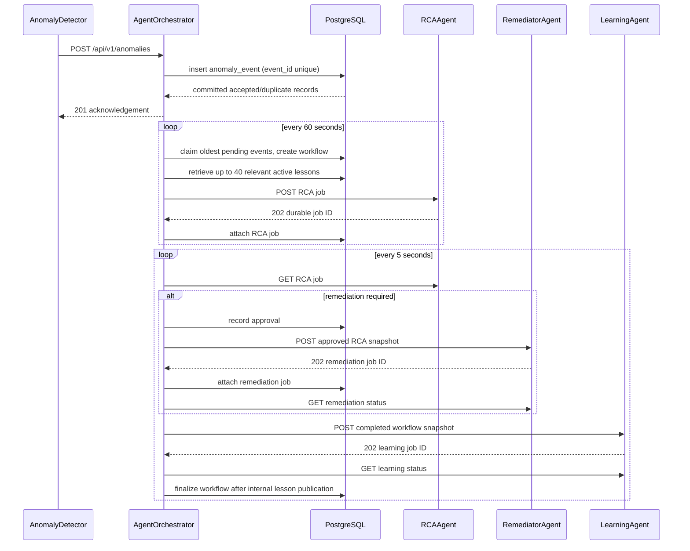

# AgentOrchestrator architecture and flow

## Purpose and ownership

AgentOrchestrator is the durable control plane for the agent platform. It
accepts detector events, creates incident workflows, submits jobs to the three
agent services, reconciles their status, owns remediation decisions, publishes
validated lessons, and exposes workflow/lesson control APIs.

It is the only long-running application with PostgreSQL credentials. RCAAgent,
RemediatorAgent, and LearningAgent call its internal HTTP API instead of
connecting to the database. DatabaseJob owns DDL and Alembic migrations;
AgentOrchestrator owns runtime DML.

AgentOrchestrator does not query Kubernetes, Prometheus, Loki, Jaeger, or MCP
directly. It also does not execute model inference. Those responsibilities are
kept behind RCAAgent, RemediatorAgent, LearningAgent, and MCPTools.

## Runtime dependencies

| Dependency | Why it is needed | Failure effect |
| --- | --- | --- |
| PostgreSQL | Events, workflows, jobs, leases, tool audits, artifacts, and lessons | Ingestion and all internal job APIs fail; no durable progress is possible. |
| RCAAgent | Creates and reads asynchronous RCA jobs | New batches cannot enter investigation; existing RCA reconciliation pauses. |
| RemediatorAgent | Creates and reads approved remediation jobs | Approved workflows remain unsubmitted or unreconciled. |
| LearningAgent | Creates and reads post-incident learning jobs | Successful RCA/remediation waits in learning submission/reconciliation. |
| DatabaseJob migration head | Supplies the schema expected by the store | Startup may succeed, but database operations fail on missing columns/tables. |

## High-level sequence



## 1. Event ingestion

AnomalyDetector calls `POST /api/v1/anomalies` with the ingestion bearer token.
One request may contain 1–1000 envelopes. Each envelope includes a deterministic
`event_id`, timezone-aware detection timestamp, namespace for namespaced
resources, resource, name, metric, method, detail, and optional detector-profile
provenance. Cluster-scoped resources use a null namespace.

The store inserts each event with `ON CONFLICT (event_id) DO NOTHING`. It then
reads the persisted row and returns a record marked `duplicate=true` when the
identity already exists. The transaction is committed before HTTP 201 is
returned. Consequently, both a newly accepted event and a duplicate are safe
acknowledgements to the detector.

New rows begin in `anomaly_event.status=pending` with no workflow. Ingestion
does not synchronously call RCAAgent; this isolates detector latency from model
and MCP latency.

## 2. Intake, batching, and durable workflow creation

The intake loop runs every `scheduler.intake_interval_seconds` (60 seconds in
the cluster ConfigMap). It first checks whether the singleton execution slot is
available. If another RCA, remediation, or learning job owns the slot, intake
does not create another RCA batch during that cycle.

When available, the store finds the oldest pending event, locks up to
`scheduler.batch_size` (100 by default) from that same namespace scope, creates
one `agent_workflow`, associates those events with it, and marks the workflow
for RCA submission. Cluster-scoped events form a separate null-namespace batch.
The batch is ordered by `detected_at` and stable database identity. This avoids
mixing identically named workloads from different applications in one RCA.

If RCA submission fails, `fail_submission` returns the events to `pending` and
deletes the newly created workflow. This permits a later intake cycle to retry
without losing or duplicating the committed detector events.

## 3. Historical lesson retrieval

Before submitting RCA, the orchestrator reads active `incident_lesson` rows.
A lesson with an explicit namespace is ineligible for anomalies in another
namespace; null-namespace lessons remain cluster-wide. It then ranks each
eligible lesson against every anomaly in the batch:

1. exact resource, name, and metric;
2. matching metric and resource;
3. matching metric;
4. matching resource;
5. otherwise newest first.

Results are deduplicated by stored lesson identity, remain in ranking order,
stop at 40 entries, and stop before the serialized selection would exceed
24,000 characters. Disabled lessons are excluded.

The lessons are sent in `historical_lessons`, separate from `caller_context`.
They are historical hypotheses rather than executable instructions. RCAAgent
must verify them using current cluster evidence.

## 4. RCA submission and reconciliation

AgentOrchestrator calls RCAAgent with a deterministic idempotency key:
`workflow:<workflow-id>:rca:<attempt>`. The request contains the workflow ID,
raw anomaly envelopes, and ranked lessons. RCAAgent returns HTTP 202 only after
the job is persisted through the internal store API.

The workflow moves to `rca_queued`; polling reflects the downstream job as
`rca_running`. On success:

- `remediation_required=false` moves to `learning_submitting`;
- `remediation_required=true` moves to `awaiting_approval`;
- failed or review-like RCA outcomes move the workflow to `failed`.

The current reconciler automatically approves an RCA-required remediation with
actor `agent-orchestrator` and reason `automatic approval after RCA required
remediation`. The control API remains available for a manual decision while a
workflow is still in `awaiting_approval`.

## 5. Remediation submission and reconciliation

The remediation request contains:

- workflow and RCA job IDs;
- the complete structured RCA result;
- SHA-256 of compact key-sorted RCA JSON;
- approval actor, reason, and workflow version.

The idempotency key is
`workflow:<workflow-id>:remediation:<attempt>`. RemediatorAgent independently
validates the hash, approval metadata, and `remediation_required=true` before
persisting the job.

`remediation_queued` and `remediation_running` are non-terminal. Verified
success moves the workflow to `learning_submitting`. A failed execution becomes
`failed`; a crash or ambiguous result after mutation becomes `failed` and
is never blindly replayed.

## 6. Learning submission and finalization

Learning is started only after successful no-action RCA or successful verified
remediation. Declined and failed workflows do not generate
lessons.

The source snapshot contains workflow ID, anomalies, structured RCA result,
optional successful remediation result, completion type, and at most 100
bounded tool-call audits. Oversized audits are reduced to metadata plus bounded
argument/result excerpts. The complete snapshot is canonicalized and protected
by SHA-256 before submission with
`workflow:<workflow-id>:learning:<attempt>`.

LearningAgent validates the snapshot, claims the shared execution slot, and
returns zero or more schema-valid lessons. Its internal finish request is
validated again by AgentOrchestrator. Successful job completion, lesson inserts,
and execution-slot release are committed in one transaction. Empty lesson lists
are valid.

The workflow ends as `completed_no_action` or `completed_remediated`. After the
third failed learning attempt it still receives the appropriate successful
workflow completion status, but `learning_status=failed`, `learning_error` is
preserved, and no lessons are published.

## Workflow states

```text
pending events
  -> rca_queued -> rca_running
       -> learning_submitting -> learning_queued -> learning_running
            -> completed_no_action
       -> awaiting_approval -> remediation_queued -> remediation_running
            -> learning_submitting -> learning_queued -> learning_running
                 -> completed_remediated

failure branches:
  RCA failure -------------------------------> failed
  remediation failure ------------------------> failed
  ambiguous remediation ----------------------> failed
  decline while awaiting approval ------------> closed_declined
  third learning failure ---------------------> completed_* + learning_status=failed
```

Workflow `version` increments on state changes and decisions. Control requests
must send `expected_version`; stale writes return HTTP 409.

## Global execution slot and leases

`agent_execution_slot(id=1)` serializes all active RCA, remediation, and
learning execution, including jobs submitted directly to public job APIs. A
worker claims the slot and a queued job in one database transaction, increments
the job attempt count, and records lease owner/expiry. Workers renew through the
internal API while inference/tool work continues.

Expired RCA and learning leases are requeued while attempts remain, then fail.
Expired remediation leases become `failed` because a mutation may already
have occurred. Workflows waiting for approval do not occupy the slot.

## Lesson control

Control-token callers may list/get lessons and enable or disable a lesson.
Enable/disable requests require actor, reason, and expected version. Changing
`active` never deletes source evidence; it changes future RCA retrieval only.
Automatic publication means the JSON satisfied structural validation, not that
its conclusion is guaranteed correct.

## Authentication boundaries

| Token | Allowed surface | Peers sharing the value |
| --- | --- | --- |
| `AGENT_INGESTION_TOKEN` | `POST /api/v1/anomalies` | AnomalyDetector |
| `AGENT_CONTROL_TOKEN` | workflows and lessons | Human/control client only |
| `AGENT_STORE_TOKEN` | `/api/v1/internal/*` | RCAAgent, RemediatorAgent, LearningAgent |
| `RCA_SUBMIT_TOKEN` | RCAAgent public job API | RCAAgent |
| `REMEDIATOR_SUBMIT_TOKEN` | RemediatorAgent public job API | RemediatorAgent |
| `LEARNING_SUBMIT_TOKEN` | LearningAgent public job API | LearningAgent |

Keep all values distinct except the intentional pairwise matches.

## Configuration

| Setting | Cluster default | Meaning |
| --- | --- | --- |
| `database.dsn` | Secret substitution | PostgreSQL connection string. |
| `api.port` | `8080` | HTTP listen port. |
| `rca.base_url` | RCAAgent ClusterIP DNS | RCA public API. |
| `remediator.base_url` | RemediatorAgent ClusterIP DNS | Remediation public API. |
| `learning.base_url` | LearningAgent ClusterIP DNS | Learning public API. |
| `scheduler.intake_interval_seconds` | `60` | Pending-event claim interval. |
| `scheduler.reconcile_interval_seconds` | `5` | Downstream status poll interval. |
| `scheduler.batch_size` | `100` | Maximum events in one RCA workflow. |

Settings use dotted nesting and are loaded from `/app/.env`, while tokens and
DSN arrive from the component Secret and are expanded into the mounted file.

## Operations and troubleshooting

- Ingestion 401: verify the detector and orchestrator ingestion tokens match.
- Ingestion 5xx: check PostgreSQL reachability and migration head first.
- Pending events never claimed: inspect the singleton slot and intake loop;
  another job may legitimately own it.
- Workflow remains queued: inspect the matching job service, its store token,
  and whether another service holds the global lease.
- RCA/remediation/learning submission repeats: idempotency returns the existing
  job; investigate downstream availability rather than deleting rows.
- Learning failed but workflow completed: expected after attempt three; inspect
  `learning_error` and raw model output before retrying manually.
- Lesson not supplied to RCA: confirm it is active, relevant to batch scope,
  and fits before the 24,000-character cutoff.
- HTTP 409: re-read current version and reassess; do not blind retry.

## Source map

| File | Responsibility |
| --- | --- |
| `app/api.py` | Application composition, dependency construction, router registration, and lifecycle. |
| `app/features/agent_workflow/router.py` | Ingestion/control/internal HTTP routes and authenticated mutation guards. |
| `app/features/agent_workflow/workflow_coordinator.py` | Intake, reconciliation, workflow control, downstream snapshots, and triggers. |
| `app/features/agent_workflow/coordinator_loops.py` | Intake and reconciliation thread lifecycle. |
| `app/features/agent_workflow/workflow_store.py` | Transactions, workflow transitions, leases, lesson ranking/publication. |
| `app/features/agent_workflow/agent_client.py` | RCA/remediation/learning HTTP clients and canonical hashes. |
| `app/features/agent_workflow/schema.py` | Agent API validation and stable data models. |
| `app/features/evaluation/` | Runner HTTP routes, control service, persistence repository, request schema, and export SQL. |
| `app/infrastructure/` | Shared database connection source, maintenance gate, authentication, and conflict error. |
| `app/config.py` | Dotted environment configuration. |
| `kubernetes/configmap.yaml` | In-cluster addresses and scheduler defaults. |
| `kubernetes/network-policy.yaml` | Agent-platform ingress boundary. |

See [agent-api.md](agent-api.md) for every endpoint and stable OpenAPI
`operationId`.

## Evaluation maintenance

See [evaluation control](evaluation-api.md). Its durable singleton and PostgreSQL
advisory locks synchronize maintenance with dispatch and mutating requests.
During evaluation baseline the HTTP interface stays available; the Runner owns
worker scaling via its configured integration. Reset and export never require
Runner database credentials.
