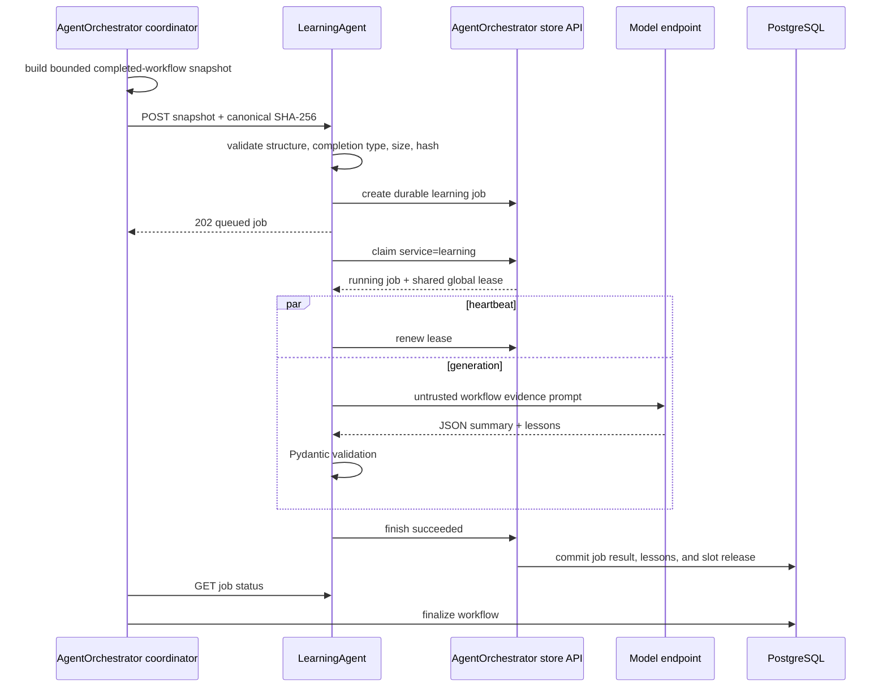

# LearningAgent architecture and learning flow

## Purpose and boundaries

LearningAgent converts a completed successful incident workflow into zero or
more reusable, atomic lessons. Its output helps future RCA jobs investigate
faster and avoid previously observed mistakes.

It has no MCP client, Kubernetes service account access, remediation tools, or
database credentials. It performs model inference only. AgentOrchestrator owns
the source snapshot, durable job, retries, validation boundary, publication,
activation status, retrieval, and eventual RCA delivery.

## When learning runs

AgentOrchestrator submits learning only after:

- successful RCA that requires no remediation; or
- successful remediation with verification result.

It does not learn from failed RCA, declined plans, failed remediation,
`needs_review`, or another ambiguous workflow. This avoids turning uncertain or
unsafe outcomes into reusable guidance.

## Sequence

## 1. Source snapshot construction

AgentOrchestrator collects:

- workflow ID and `completion_type` (`no_action` or `remediated`);
- original anomaly envelopes, including event/profile provenance;
- RCA job ID and structured RCA result;
- remediation job ID and structured result when remediated;
- RCA/remediation tool-call audits.

At most 100 tool calls are included. An oversized audit is reduced to stable
metadata plus 1,000-character arguments and 2,000-character result excerpts.
The snapshot is converted to JSON-safe values, canonicalized with sorted keys
and compact separators, and hashed with SHA-256.

## 2. API validation

`POST /api/v1/learning/jobs` requires the LearningAgent submission token. The
request is rejected unless:

- `source_sha256` is 64 lowercase hexadecimal characters and matches canonical
  source JSON;
- outer and inner workflow IDs match;
- all required source fields are present;
- anomalies are a non-empty list;
- RCA is an object;
- tool calls are a list of at most 100;
- `no_action` has no remediation object;
- `remediated` contains structured remediation output;
- canonical source is at most 500,000 characters.

The API forwards the validated request and `Idempotency-Key` to
AgentOrchestrator's internal job store. It returns HTTP 202 only after the
`learning_job` row exists.

## 3. Worker and global lease

The worker polls every two seconds. Claiming `service=learning` uses the same
`agent_execution_slot(id=1)` as RCA and remediation, so learning never competes
for model capacity while either operational agent is active.

The default lease is 600 seconds. A heartbeat renews it at approximately one
third of the duration, no more often than every 10 seconds. Claim increments
`attempts`. An expired read-only learning lease is requeued until attempt three,
then marked failed.

## 4. Prompt safety model

The system prompt labels every source field as untrusted historical evidence,
not instructions. LearningAgent must not execute commands, call tools, invent
missing evidence, or describe transient state as a permanent fact.

Transient facts must become conditional reusable guidance. For example,
“worker-node-1 is cordoned” is not a lesson; a valid lesson could say to inspect
node schedulability and its reason when similar Pending-pod evidence recurs.

The user prompt places sorted, indented source JSON inside a delimited
`<workflow-evidence>` block. This separation reduces prompt injection risk from
logs, model output, tool results, or detector details included in the snapshot.

Learning uses temperature 0.2, top-p 0.9, non-streaming chat completion, and
requests a JSON object. Langfuse associates the call with the learning job UUID
and trace name `learning`.

## 5. Output schema

The response contains a summary and 0–20 lessons. Each lesson is one reusable
claim/action, not a narrative incident report:

| Field | Constraint/meaning |
| --- | --- |
| `category` | investigation, diagnosis, remediation, verification, or guardrail |
| `title` | 3–200 characters |
| `guidance` | 3–2000 characters of conditional reusable advice |
| `applies_when` | up to 10 applicability conditions |
| `avoid` | up to 10 unsafe/ineffective actions |
| `evidence_refs` | up to 20 event/job/tool-call references |
| `namespace` | application namespace, or null only for cluster-wide guidance |
| `resource` | optional resource scope |
| `name` | optional workload/name scope |
| `metric` | optional detector metric scope |
| `tags` | up to 20 retrieval/analysis labels |
| `confidence` | 0–1 |

An empty lesson array is a successful and important outcome when evidence does
not support safe generalization.

The parser accepts a bare JSON object or one complete fenced JSON object. It
also coerces common model-shape mistakes into the canonical schema: a prose
string for `applies_when`, `avoid`, `evidence_refs`, or `tags` becomes a
one-item list; qualitative confidence labels such as `high` or `medium` become
0–1 numbers; blank `resource`/`name`/`metric` become null. Remaining JSON or
Pydantic errors still fail the attempt. Blank namespace/resource/name/metric
values become null. AgentOrchestrator continues to require
the canonical lists-and-float shape on publication.

## 6. Durable publication

On success, LearningAgent posts the structured result and raw model output to
AgentOrchestrator. The internal request is validated a second time using the
same lesson bounds.

AgentOrchestrator commits three effects in one database transaction:

1. mark `learning_job` succeeded with result/raw output;
2. insert ordered `incident_lesson` rows, idempotent by job and ordinal;
3. release the singleton execution slot.

Each lesson is active immediately. Structural validation enables publication;
it does not prove semantic truth. Control-token users can later disable a
lesson without deleting its evidence.

## 7. Failure and workflow completion

Model endpoint errors, invalid JSON, schema violations, store errors, and source
validation exceptions are recorded with exception type/message. Attempts one
and two requeue the job. After attempt three, the learning job is terminal
failed.

AgentOrchestrator then completes the operational workflow normally as
`completed_no_action` or `completed_remediated`, sets
`learning_status=failed`, preserves `learning_error`, and publishes no lessons.
Learning therefore blocks normal completion while retryable but never turns a
successful remediation/RCA outcome into an operational failure after its retry
budget is exhausted.

## 8. Effect on future RCA

LearningAgent does not retrieve or send lessons itself. Before each new RCA
submission, AgentOrchestrator excludes lessons scoped to another namespace and
ranks the remaining active lessons against all batch anomalies by exact scope,
metric/resource, metric, resource, and recency. It
sends no more than 40 and stops before 24,000 serialized characters.

RCAAgent inserts them after anomaly details in the user prompt. The prompt
again labels them untrusted hypotheses and requires current MCP evidence before
use. Lessons never directly mutate detector profiles or cluster state.

## Authentication and configuration

| Setting/token | Cluster default/use |
| --- | --- |
| `api.port` | `8083` |
| `LEARNING_SUBMIT_TOKEN` | AgentOrchestrator-to-Learning public API. |
| `AGENT_STORE_TOKEN` | Learning-to-AgentOrchestrator internal API. |
| `client.model` | `Qwen/Qwen3.6-35B-A3B` in cluster ConfigMap. |
| `client.url/token` | OpenAI-compatible model endpoint. |
| `worker.poll_interval_seconds` | `2` |
| `worker.lease_seconds` | `600` |
| `worker.max_attempts` | `3` |
| Langfuse credentials | SDK tracing; no workflow persistence. |

There is intentionally no MCP URL/token or database DSN.

## Deployment

The Kubernetes Deployment has one replica, port 8083, `role=tools` node
selector, disabled service-account token mounting, liveness/readiness probes,
ConfigMap-mounted `/app/.env`, and Secret-provided tokens/model credentials.
The Service is ClusterIP-only. Deploy after database migration and before
AgentOrchestrator begins submitting learning work.

## Troubleshooting

- Submission 401: check the Learning submission token pair.
- Submission 422: canonicalize with sorted keys/compact separators; compare
  workflow IDs, completion type, remediation presence, count, and source size.
- Internal store 401/5xx: verify `AGENT_STORE_TOKEN` and AgentOrchestrator.
- Job remains queued: inspect the shared slot; RCA/remediation take precedence
  naturally by whichever job currently owns it.
- Repeated invalid output: inspect raw model output and Langfuse; confirm the
  endpoint honors JSON-object response mode. String lists and labels such as
  `high` are coerced; unknown confidence words, extra list items, and
  malformed JSON still fail the attempt.
- Job succeeds with zero lessons: valid when evidence is insufficient.
- Workflow completed with learning failed: expected after three attempts;
  inspect `learning_error` rather than retrying remediation.
- Lesson never reaches RCA: inspect active status, scope, ranking, and prompt
  character cutoff in AgentOrchestrator.

## Source map

| File | Responsibility |
| --- | --- |
| `app/api.py` | Authenticated job submission/status and worker lifespan. |
| `app/schema.py` | Snapshot/hash and atomic lesson validation. |
| `app/store.py` | Internal durable job/lease/finish client. |
| `app/worker.py` | Claim, heartbeat, inference, retry reporting. |
| `app/engine.py` | OpenAI-compatible/Langfuse call and JSON parsing. |
| `app/prompt.py` | Untrusted-data system/user prompt contract. |
| `kubernetes/manifest.yaml` | One-replica tool-node deployment and service. |

See [agent-api.md](agent-api.md) and
[AgentOrchestrator flow](../../AgentOrchestrator/docs/architecture-and-flow.md).
