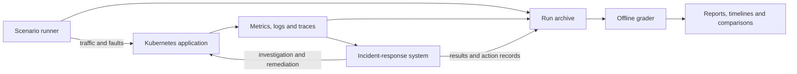

# IncidentBench

**A benchmark and evaluation platform for AI-driven Kubernetes incident response.**

IncidentBench turns incident response into an experiment you can run, inspect,
and compare. It deploys microservice applications, generates user traffic,
injects controlled faults, and captures how an incident-response system
investigates and acts. Its grader brings agent-output quality and observed
application behavior together in reports, timelines, and application comparisons.

The project includes a working reference system that connects anomaly detection,
root-cause analysis (RCA), guarded remediation, verification, and learning.
Researchers can plug in another response system through lifecycle adapters while
reusing the workloads, fault scenarios, evidence capture, and grading pipeline.

[Explore the results](EvaluationPlatform/Grader/eda/report.md) ·
[Open the analysis notebook](EvaluationPlatform/Grader/eda/report.ipynb) ·
[Browse the scenarios](EvaluationPlatform/Runner/docs/scenario.md) ·
[Read the architecture](docs/architecture.md)

## What you can do with IncidentBench

- **Exercise a complete incident-response workflow.** Follow an injected fault
  from application symptoms through detection, investigation, remediation, and
  post-action verification.
- **Run repeatable experiments.** Versioned JSON scenarios define applications,
  placement, traffic, fault schedules, and response-system lifecycle. Suites
  support repeated runs and paired agents-enabled/disabled configurations.
- **Test across applications and fault families.** The standard suites contain
  **69 configured scenarios across three microservice applications**, covering
  node and pod resource pressure, network faults, and capacity loss.
- **Inspect the evidence behind an outcome.** Each run preserves resolved inputs,
  applied chaos manifests, placement fingerprints, telemetry, lifecycle logs,
  and exported agent sessions and tool-call audits.
- **Compare diagnosis, remediation, and service behavior.** Reports expose score
  maxima and averages, session counts, response timing, latency and error changes,
  and fault-family comparisons with explicit evaluable denominators.
- **Evaluate your own response system.** Replace the bundled agents through shell
  integrations, add applications and fault scenarios, or extend the load shapes
  and grading resources.

## From fault injection to an inspectable result



The Runner establishes a baseline, activates the configured response system,
executes fault and recovery steps, and finalizes the experiment with cleanup and
evidence capture. The archive can then be analyzed without reconnecting to the
cluster. Semantic scoring uses a configured model judge; telemetry calculations
and visualization can run without model calls.

### The bundled reference agent system

```text
Detect → Investigate → Remediate → Verify → Learn
            ↑                               │
            └──── evidence-linked lessons ──┘
```

The **AnomalyDetector** turns Prometheus signals into incident leads.
**AgentOrchestrator** durably coordinates the workflow, while **RCAAgent** gathers
current evidence through **MCPTools**. **RemediatorAgent** validates the RCA
snapshot, checks current state, creates execution artifacts, runs Ansible check
mode, performs guarded changes, and verifies the result. **LearningAgent**
extracts evidence-linked lessons for later investigations; those lessons must
be checked against current evidence.

Investigation and remediation use separate MCP profiles, credentials, and
Kubernetes permissions. The investigation profile rejects mutating commands.
The Orchestrator automatically submits required remediation and serializes RCA,
remediation, and learning jobs through a shared execution slot. See the
[runtime flows](docs/flows.md) for the coordination and failure behavior.

## Applications and incident coverage

| Application | Standard scenarios | Entry workload |
| --- | ---: | --- |
| [Online Boutique](EvaluationPlatform/Runner/resources/suites/online-boutique.json) | 23 | `frontend` |
| [Sock Shop](EvaluationPlatform/Runner/resources/suites/sock-shop.json) | 23 | `front-end` |
| [TeaStore](EvaluationPlatform/Runner/resources/suites/teastore.json) | 23 | `teastore-webui` |

The nine fault families are node CPU pressure, node memory pressure, node network
delay, node packet loss, pod CPU pressure, pod memory pressure, pod bandwidth
restriction, pod CPU headroom constraints, and pod capacity loss. Traffic can
follow constant, burst, sinusoidal, or daily patterns.

These are configured experiments; the number of completed, evaluable runs is
reported separately. Application workloads and fault targets differ, so
cross-application results should be read alongside their scenarios and baselines.

## What the evaluation tells you

IncidentBench reports three complementary views:

| View | What it measures |
| --- | --- |
| Agent-output quality | RCA and remediation reports scored against scenario-specific expectations, with remediation penalties and explicit unscored outputs. |
| Application performance | Baseline versus the selected best chaos window, including latency, HTTP 5xx rate, and tolerance outcome. |
| Service recovery proxy | Sustained latency, reliability, and throughput behavior derived from archived measurements under a separate recovery policy. |

A successful agent job or high semantic score does not establish that a change
was applied or that service recovered. Reports preserve these distinctions,
missing evidence, and measurement denominators. The
[grading methodology](EvaluationPlatform/Grader/docs/methodology.md) explains
what each assessment supports.

### See an example

The [generated report](EvaluationPlatform/Grader/eda/report.md) and
[notebook](EvaluationPlatform/Grader/eda/report.ipynb) show the current experiment
snapshot, including application comparisons, session and score summaries,
response timing, and fault-family outcomes. The notebook presents each table
in its own cell and recomputes measurements from local archives and existing grades.


The chart compares semantic scenario attainment and frontend window tolerance.
Labels show successful/evaluable counts; it illustrates the bundled reference
system's recorded behavior under these experiments.

## Try the project

**Explore without a cluster.** Install the Grader requirements and run the
small [synthetic reporting demo](EvaluationPlatform/Grader/eda/README.md#offline-demonstration)
from a fresh clone:

```bash
python -m pip install -r EvaluationPlatform/Grader/requirements.txt
python EvaluationPlatform/Grader/eda/report.py \
  --results-dir EvaluationPlatform/Grader/examples/report-demo/results \
  --grades-dir EvaluationPlatform/Grader/examples/report-demo/grades \
  --apps sock-shop online-boutique \
  --output EvaluationPlatform/Grader/eda/exports/demo/report.md
```

The bundled fixture contains illustrative scores, not research results. It
makes no model or cluster calls; absent telemetry remains unknown. Full research
archives and grades are intentionally excluded from Git. With your own archives
under the Grader's `results/` and `grades/`, run
`python EvaluationPlatform/Grader/eda/report.py` to regenerate the real-data
report. See the [Grader guide](EvaluationPlatform/Grader/README.md) for new runs,
`--operational-only` assessment, and visualization commands.

**Demonstrate the live workflow.** On a prepared evaluation cluster, the
[three-application CPU smoke suite](EvaluationPlatform/Runner/resources/suites/cpu-smoke.json)
provides a focused walkthrough: establish traffic and a baseline, inject CPU
stress, observe the agent workflow, then inspect the captured evidence and
reports. Validate its configuration from the Runner directory first:

```bash
cd EvaluationPlatform/Runner
python -m testbed.main --suite resources/suites/cpu-smoke.json \
  --environment config/environment.json --validate-only
```

Validation is local. After setup, omit `--validate-only` to execute the suite.
Live bundled experiments reset solution workflow and lesson data, recreate
application namespaces, and inject faults, so use a dedicated evaluation
cluster. The [Runner guide](EvaluationPlatform/Runner/README.md) covers setup,
execution, live tracking, and extension interfaces.

## Repository guide

| Area | Purpose |
| --- | --- |
| [Initialization](EvaluationPlatform/Initialization/README.md) | Cluster and node preparation, namespaces, and platform tools. |
| [Runner](EvaluationPlatform/Runner/README.md) | Applications, traffic, scenarios, chaos, lifecycle integrations, and evidence capture. |
| [Grader](EvaluationPlatform/Grader/README.md) | Archived-run assessment, plots, reports, and exploratory analysis. |
| [Orchestrator](EvaluationPlatform/Orchestrator/README.md) | Durable coordination for the reference agents and its evaluation API. |
| [Database](EvaluationPlatform/Orchestrator/Database/README.md) | PostgreSQL deployment and schema migrations. |
| [Agents](docs/components.md) | Detection, RCA, remediation, learning, and MCP tool services. |
| [Documentation](docs/README.md) | Architecture, runtime flows, contracts, and component guides. |

## Deployment and operations

The bundled scenarios assume a control-plane node, a tools node labelled
`role=tools`, and six service workers named `worker-node-1` through
`worker-node-6`, labelled `role=services`. For another topology, adapt the
inventory, node-IP mapping, application placement overlays, and chaos selectors
together. See [topology configuration](docs/infrastructure.md#cluster-topology).
Example addresses are placeholders; keep actual addresses and credentials in
ignored local configuration.

Builds and deployments require the same explicit `IMAGE_REGISTRY` and
`IMAGE_TAG`. Checked-in first-party image references are markers, not published
images. Expand the checklist for configuration and execution commands.

<details>
<summary>Deployment checklist and commands</summary>

## Prepare a deployment

1. Copy `EvaluationPlatform/Initialization/ansible/inventory.example.ini` to ignored `inventory.ini`. Fill SSH addresses, users, and Chaosd endpoints for your nodes. Review `group_vars/all.yml` and `vault.example.yml`; see the initialization guide for cluster prerequisites, Ansible dependencies and playbook order.
2. Copy each deployed component's `kubernetes/secret.example.yml` to ignored `kubernetes/secret.yml`. Replace required `++++++++` values. Keep ingestion, control, job-store, service-submission, and the two MCP tokens distinct; matching peers must receive the same value for their shared token.
3. Copy `EvaluationPlatform/Runner/config/environment.example.json` to ignored `environment.json`. Set service endpoints, inventory path, and `node_ips` to the actual node InternalIPs. The documentation addresses in the example are not cluster addresses. Export the variable named by `control_token_env`, normally `ORCHESTRATOR_CONTROL_TOKEN`, with the Orchestrator's `AGENT_CONTROL_TOKEN` value. Do not put credentials in JSON.
4. Deploy in dependency order: Initialization prerequisites → Orchestrator/Database → both MCP profiles → LearningAgent, RCAAgent, RemediatorAgent → Orchestrator → AnomalyDetector → optional Runner pod. Each component retains its own `deploy.sh` (Runner uses `scripts/deploy.sh`); commands use the current Kubernetes context. Database migrations are a separate job, never application startup work.

For an existing deployment, stop the detector and job workers before deploying the new database migration and Orchestrator API. Migration `20260913_0005` adds evaluation ownership without clearing existing workflow data. The older legacy-table migration still requires its explicit reset flag when applicable. Do not set that flag merely to install this additive migration.

## Build component images

Copy [deployment/image.env.example](deployment/image.env.example) to the ignored
`deployment/image.env`, set a registry/namespace you can push to and a versioned
tag, and load it into your shell. Use the same file for component and root scripts:

```bash
cp deployment/image.env.example deployment/image.env
# Edit deployment/image.env with your registry and chosen version.
source deployment/image.env
./build.sh
./build.sh rca-agent mcp-tools
./build.sh database-job runner
PLATFORM=linux/arm64 ./build.sh learning-agent
```

Run `./build.sh --help` for component names. Each image is named
`IMAGE_REGISTRY/<component>:IMAGE_TAG`. Docker Buildx and registry login with
push access are required. Make images publicly pullable if you want other users
to deploy them without registry credentials; this repository does not publish
images automatically. The default platform is `linux/amd64`; builds run
sequentially and stop on the first failure. Initialization and Grader have no
component Docker images.

Individual scripts also work from the project root, for example
`./Agents/RCAAgent/build.sh` or
`./EvaluationPlatform/Runner/scripts/build.sh`. Each script resolves its own
build context; Runner uses the repository root. Building images does not deploy
them or run database migrations.

## Update all agent deployments

After platform prerequisites and database migrations are installed, run
`./deploy.sh` from the workspace root. It applies each component's current local
Kubernetes files in dependency order: MCPTools, LearningAgent, RCAAgent,
RemediatorAgent, Orchestrator, then AnomalyDetector. It restarts all seven
Deployments and waits for readiness so ConfigMap and Secret changes take effect.

Populate each component's ignored `kubernetes/secret.yml` first. The script uses
kubectl's current context; run it when evaluations and agent jobs are idle. It
stops on failure without rollback. It does not build images, deploy the Runner,
install infrastructure, or execute database migrations. First-party image markers
are rendered in memory using `IMAGE_REGISTRY` and `IMAGE_TAG`; source manifests
and upstream image references remain unchanged. Missing or invalid settings fail
before deployment. Use the component scripts rather than applying marker-bearing
workload YAML directly. For existing application namespace bindings, the MCPTools script
also accepts `APPLICATION_NAMESPACES="online-boutique teastore sock-shop"`.

## Scale down the agent platform

Run `./scale.sh` from the project root when evaluations and agent jobs are idle.
It sets replicas to zero for AnomalyDetector, Orchestrator, RCAAgent,
RemediatorAgent, LearningAgent, and both MCPTools deployments in namespace
`agents`, using kubectl's current context. It checks that all seven deployments
exist before scaling. Kubernetes terminates their pods asynchronously.

## Validate and run

Install `EvaluationPlatform/Runner/requirements.txt` in your Python environment, plus kubectl, Helm and SSH. From the Runner directory:

```bash
python -m testbed.main --scenario resources/scenarios/online-boutique-scenario/01-node-delay-worker-3.json \
  --environment config/environment.json --validate-only

python -m testbed.main --scenario resources/scenarios/online-boutique-scenario/01-node-delay-worker-3.json \
  --environment config/environment.json

python -m testbed.main --suite resources/suites/paired.json --environment config/environment.json
```

Validation reads configuration, catalogs and application sources, and checks local installer binaries. It does not contact or change the cluster. A real bundled run **clears all solution workflow and lesson data**, recreates application namespaces, scales configured deployments, and applies chaos. Use a dedicated evaluation cluster/deployment; runs are serial.

Standard scenarios use a 30-minute baseline; AnomalyDetector queries the latest
30 minutes at 30-second spacing. Explicit short test scenarios keep their own
baseline durations.

Constant-load scenarios target 200 concurrent users for TeaStore, 600 for
Online Boutique, and an initial 100 for Sock Shop, with an upward random bias
of up to 10% (20, 60, and 10 users respectively). These targets and bias values
are configured in each scenario's `load.parameters`.

Online Boutique's 23 standard scenario names use the `online-boutique-` prefix,
matching the application prefixes used by TeaStore and Sock Shop. Their JSON
file paths are unchanged; the grader also retains the historical `real-` names.

Run JSON owns experiment behavior. There are no load, timing, deployment, or agent-mode CLI overrides. Suite JSON describes repeated and paired experiments. Resolved scenarios, exact applied chaos YAML, placement fingerprints, metrics, lifecycle logs, and exported sessions remain in the output folder.

## Grade archived runs

Install `EvaluationPlatform/Grader/requirements.txt`, then from its directory:

```bash
python -m grader --input ../Runner/results --output grades/my-assessment
python -m visualizer --input ../Runner/results --output visualizations/my-assessment
```

Configure the judge endpoint/model/token using the grader's documented CLI/environment interface. No database or live cluster access is needed for grading. Existing archived run formats remain supported.

If a run fails, consult `run-status.json`, `hooks.json`, and `hooks/`. Ownership remains held after unsafe cleanup or hook failures. Follow [interrupted-run recovery](EvaluationPlatform/Orchestrator/docs/evaluation-api.md#interrupted-run-recovery) before starting another run.

</details>
