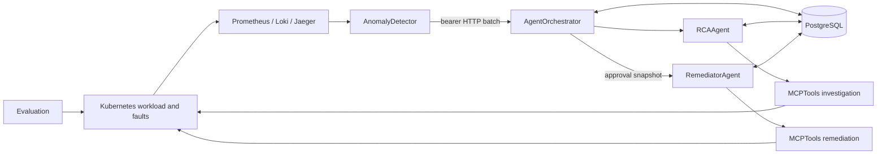

# Architecture

AgentOrchestrator owns workflow state and decisions. RCAAgent owns analysis and
sub-agent orchestration. RemediatorAgent owns approved execution and
verification. MCPTools owns all cluster-facing capabilities and is deployed
twice: a read profile with read-oriented RBAC, and a remediation profile with a
separate token, bounded RBAC, one replica, and a PVC.

The singleton `agent_execution_slot` serializes all RCA and remediation jobs,
including direct API submissions. Approval waiting does not hold the lease.
Every HTTP Service is ClusterIP-only. NetworkPolicy, bearer authentication,
server-side tool profiles, and Kubernetes RBAC are independent security layers.

Deployment ownership follows runtime ownership: every component keeps its
ConfigMap, placeholder Secret, manifests, and a deploy script that uses
kubectl's current context. AgentOrchestrator owns the shared ingress
NetworkPolicy. DatabaseJob owns PostgreSQL and migration resources.
Infrastructure installs platform tools and namespaces only.
