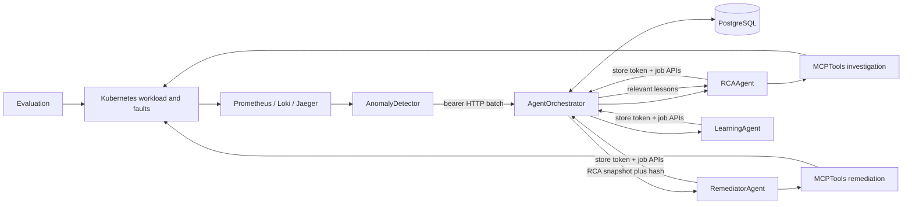

# Architecture

AgentOrchestrator owns workflow state, decisions, and all application DML.
RCAAgent owns analysis and sub-agent orchestration. RemediatorAgent owns
approved execution and verification. All three job services persist through
Orchestrator HTTP APIs and do not hold PostgreSQL credentials. LearningAgent
turns successful workflow evidence into atomic lessons and also persists only
through Orchestrator. MCPTools owns
all cluster-facing capabilities and is deployed twice: a read profile with
read-oriented RBAC, and a remediation profile with a separate token, bounded
RBAC, one replica, and a PVC.

The singleton `agent_execution_slot` serializes RCA, remediation, and learning jobs,
including direct API submissions. Automated `awaiting_approval` does not hold
the lease; remediator claims it after RCA releases.
Every HTTP Service is ClusterIP-only. NetworkPolicy, bearer authentication,
server-side tool profiles, and Kubernetes RBAC are independent security layers.

Application namespace is a first-class incident field. The detector preserves
it from Prometheus labels, AgentOrchestrator isolates namespaced batches and
lesson retrieval, RCA profiles the incident namespace rather than assuming an
application topology, and remediation authority is granted per namespace with
a RoleBinding. Cluster-scoped node incidents remain explicit and may require
profiling every configured application namespace.

Deployment ownership follows runtime ownership: every component keeps its
ConfigMap, placeholder Secret, manifests, and a deploy script that uses
kubectl's current context. AgentOrchestrator owns the shared ingress
NetworkPolicy. DatabaseJob owns PostgreSQL and migration resources.
Infrastructure installs platform tools and namespaces only.
